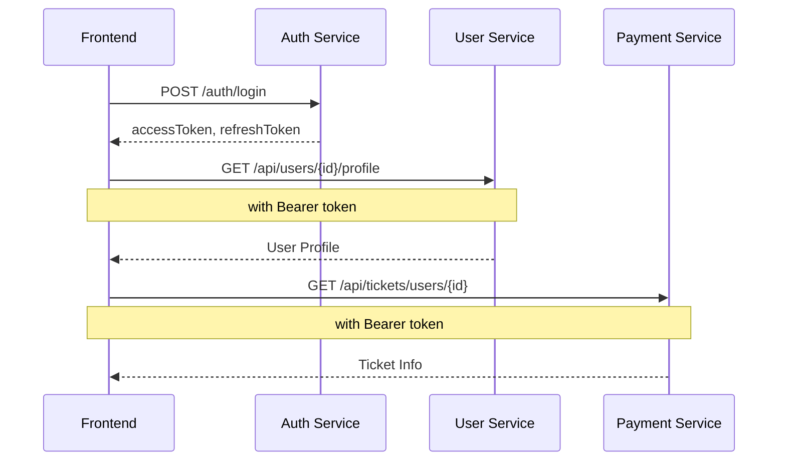
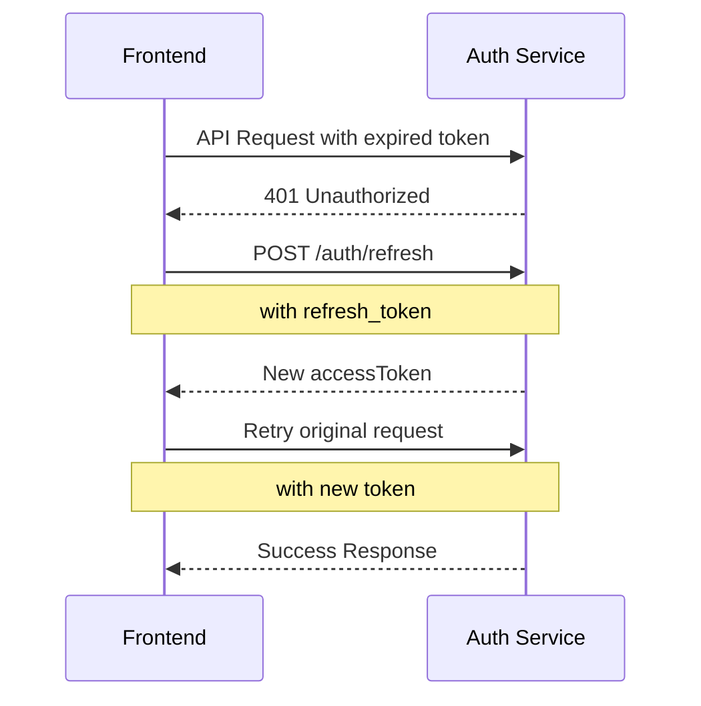
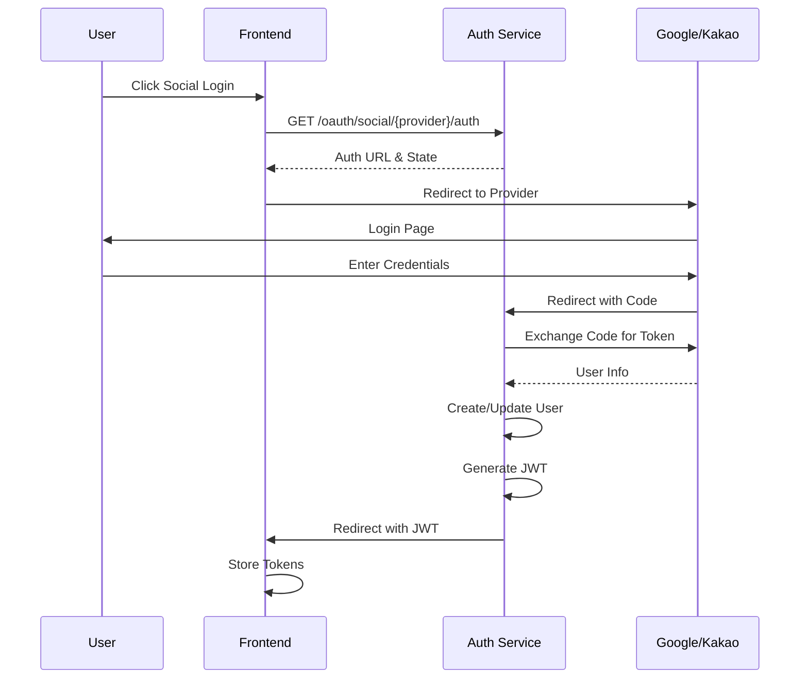

# DevTrip 프론트엔드 API 연동 가이드

## 목차
1. [서비스 Base URL](#서비스-base-url)
2. [공통 요구사항](#공통-요구사항)
3. [Authentication Service API](#authentication-service-api)
   - [기본 인증 API](#기본-인증-api)
   - [소셜 로그인 API](#소셜-로그인-api)
   - [관리자 API](#관리자-api)
4. [User Management Service API](#user-management-service-api)
5. [Payment Service API](#payment-service-api)
6. [Mission Management Service API](#mission-management-service-api)
   - [미션 관리 API](#미션-관리-api)
   - [미션 실행 API](#미션-실행-api)
   - [WebSocket 연동](#websocket-연동)
7. [AI Evaluation Service API](#ai-evaluation-service-api)
8. [에러 코드 및 처리](#에러-코드-및-처리)
9. [인증 플로우](#인증-플로우)

---

## 서비스 Base URL

| 서비스 | Base URL | 포트 | 설명 |
|--------|----------|------|------|
| Authentication Service | `http://localhost:8080` | 8080 | 인증/로그인 관련 |
| Payment Service | `http://localhost:8081` | 8081 | 결제/티켓/구독 관련 |
| User Management Service | `http://localhost:8082` | 8082 | 사용자 프로필/팀 관리 |
| Mission Management Service | `http://localhost:8083` | 8083 | 미션 관리/실행 관련 |
| AI Evaluation Service | `http://localhost:8084` | 8084 | AI 평가/분석 관련 |

---

## 공통 요구사항

### 1. 인증 헤더
모든 보호된 API 엔드포인트는 JWT 토큰이 필요합니다:
```
Authorization: Bearer {accessToken}
```

### 2. Content-Type
요청 시 JSON 데이터를 보낼 때:
```
Content-Type: application/json
```

### 3. CORS 설정
현재 모든 origin에서 접근 가능 (`*`)하도록 설정되어 있음

### 4. 응답 형식
- 성공: HTTP 200/201 with JSON body
- 실패: HTTP 4xx/5xx with error details

---

## Authentication Service API

### Base URL: `http://localhost:8080`

## 기본 인증 API

### 1. 회원가입
**Endpoint:** `POST /auth/signup`

**Request Body:**
```json
{
  "email": "user@example.com",
  "password": "Password123!",
  "passwordConfirm": "Password123!",
  "name": "홍길동",
  "nickname": "gildong",
  "agreeToTerms": true,
  "agreeToPrivacyPolicy": true,
  "agreeToMarketing": false
}
```

**Response (200 OK):**
```json
{
  "success": true,
  "message": "회원가입이 완료되었습니다",
  "user": {
    "id": "uuid-string",
    "email": "user@example.com",
    "name": "홍길동",
    "role": "USER",
    "emailVerified": false
  }
}
```

**Validation Rules:**
- Email: 유효한 이메일 형식
- Password: 최소 8자, 대문자, 소문자, 숫자, 특수문자 각 1개 이상
- Name: 2-50자
- Nickname: 최대 20자
- 필수 약관 동의: agreeToTerms, agreeToPrivacyPolicy

### 2. 로그인
**Endpoint:** `POST /auth/login`

**Request Body:**
```json
{
  "email": "user@example.com",
  "password": "Password123!",
  "rememberMe": false
}
```

**Response (200 OK):**
```json
{
  "success": true,
  "message": "로그인이 완료되었습니다",
  "accessToken": "eyJhbGciOiJIUzI1NiIs...",
  "refreshToken": "eyJhbGciOiJIUzI1NiIs...",
  "user": {
    "id": "uuid-string",
    "email": "user@example.com",
    "name": "홍길동",
    "role": "USER",
    "tickets": 100,
    "emailVerified": true
  }
}
```

**Error Response (423 Locked):**
```json
{
  "error": "ACCOUNT_LOCKED",
  "message": "계정이 잠겨있습니다. 1시간 후 다시 시도해 주세요.",
  "details": {
    "failedAttempts": 5,
    "lockExpiresAt": "2024-01-01T12:00:00Z",
    "isLocked": true
  }
}
```

### 3. 토큰 갱신
**Endpoint:** `POST /auth/refresh`

**Request Body:**
```json
{
  "refresh_token": "eyJhbGciOiJIUzI1NiIs..."
}
```

**Response (200 OK):**
```json
{
  "success": true,
  "accessToken": "eyJhbGciOiJIUzI1NiIs...",
  "message": "새 Access Token이 발급되었습니다"
}
```

### 4. 로그아웃
**Endpoint:** `POST /auth/logout`

**Headers Required:**
```
Authorization: Bearer {accessToken}
```

**Request Body (Optional):**
```json
{
  "reason": "USER_LOGOUT"
}
```

**Response (200 OK):**
```json
{
  "success": true,
  "message": "로그아웃이 완료되었습니다"
}
```

### 5. 현재 사용자 정보 조회
**Endpoint:** `GET /auth/me`

**Headers Required:**
```
Authorization: Bearer {accessToken}
```

**Response (200 OK):**
```json
{
  "id": "uuid-string",
  "email": "user@example.com",
  "name": "홍길동",
  "role": "USER",
  "tickets": 100,
  "emailVerified": true,
  "pictureUrl": "https://example.com/profile.jpg",
  "isActive": true,
  "socialProvider": null
}
```

### 6. 토큰 검증
**Endpoint:** `POST /auth/validate`

**Request Body:**
```json
{
  "token": "eyJhbGciOiJIUzI1NiIs..."
}
```

**Response (200 OK - Valid):**
```json
{
  "valid": true,
  "user": {
    "id": "uuid-string",
    "email": "user@example.com",
    "name": "홍길동",
    "role": "USER",
    "tickets": 100
  }
}
```

**Response (200 OK - Invalid):**
```json
{
  "valid": false
}
```

### 7. 비밀번호 재설정 요청
**Endpoint:** `POST /auth/password-reset`

**Request Body:**
```json
{
  "email": "user@example.com"
}
```

**Response (200 OK):**
```json
{
  "success": true,
  "message": "If the email exists, a password reset link has been sent"
}
```

### 8. 서비스 테스트
**Endpoint:** `GET /auth/test`

**Response (200 OK):**
```json
{
  "message": "OAuth 2.0 인증 서비스가 정상 작동합니다",
  "timestamp": 1704085200000,
  "endpoints": {
    "POST /auth/signup": "이메일/비밀번호 회원가입",
    "POST /auth/login": "이메일/비밀번호 로그인",
    "POST /auth/validate": "JWT 토큰 검증",
    "POST /auth/password-reset": "비밀번호 재설정",
    "GET /oauth/authorize": "OAuth 2.0 Authorization Code 발급",
    "POST /oauth/token": "OAuth 2.0 Access Token 교환"
  }
}
```

### 9. 헬스체크
**Endpoint:** `GET /auth/health`

**Response (200 OK):**
```json
{
  "status": "healthy",
  "service": "oauth2-authentication-service",
  "version": "2.0",
  "deprecated": "Use /api/health instead",
  "features": {
    "localAuth": "enabled",
    "socialLogin": "enabled",
    "oauth2": "enabled",
    "redisRateLimit": "enabled"
  },
  "timestamp": 1704085200000
}
```

## 소셜 로그인 API

### 1. Google 소셜 로그인 URL 생성
**Endpoint:** `GET /oauth/social/google/auth`

**Query Parameters:**
- `redirect_uri`: 로그인 성공 후 돌아갈 URL (optional, default: `http://localhost:3000/auth/callback`)
- `state`: CSRF 방지를 위한 상태 값 (optional, 자동 생성됨)

**Response (200 OK):**
```json
{
  "auth_url": "https://accounts.google.com/o/oauth2/v2/auth?client_id=...",
  "provider": "google",
  "state": "random-state-string",
  "callback_uri": "http://localhost:8080/oauth/social/google/callback",
  "frontend_redirect": "http://localhost:3000/auth/callback"
}
```

### 2. Kakao 소셜 로그인 URL 생성
**Endpoint:** `GET /oauth/social/kakao/auth`

**Query Parameters:**
- `redirect_uri`: 로그인 성공 후 돌아갈 URL (optional, default: `http://localhost:3000/auth/callback`)
- `state`: CSRF 방지를 위한 상태 값 (optional, 자동 생성됨)

**Response (200 OK):**
```json
{
  "auth_url": "https://kauth.kakao.com/oauth/authorize?client_id=...",
  "provider": "kakao",
  "state": "random-state-string",
  "callback_uri": "http://localhost:8080/oauth/social/kakao/callback",
  "frontend_redirect": "http://localhost:3000/auth/callback"
}
```

### 3. Google 소셜 로그인 콜백
**Endpoint:** `GET /oauth/social/google/callback`

**Query Parameters:**
- `code`: Google에서 발급한 Authorization Code (required)
- `state`: CSRF 방지를 위한 상태 값 (optional)
- `error`: 오류 정보 (optional)

**Response:** 
- 성공 시: 프론트엔드로 리다이렉트 with tokens
  ```
  http://localhost:3000/auth/success?access_token={token}&refresh_token={token}&provider=google&state={state}
  ```
- 실패 시: 에러 페이지로 리다이렉트
  ```
  http://localhost:3000/auth/error?provider=google&error={error_code}
  ```

### 4. Kakao 소셜 로그인 콜백
**Endpoint:** `GET /oauth/social/kakao/callback`

**Query Parameters:**
- `code`: Kakao에서 발급한 Authorization Code (required)
- `state`: CSRF 방지를 위한 상태 값 (optional)
- `error`: 오류 정보 (optional)

**Response:**
- 성공 시: 프론트엔드로 리다이렉트 with tokens
  ```
  http://localhost:3000/auth/success?access_token={token}&refresh_token={token}&provider=kakao&state={state}
  ```
- 실패 시: 에러 페이지로 리다이렉트
  ```
  http://localhost:3000/auth/error?provider=kakao&error={error_code}
  ```

### 5. 소셜 로그인 서비스 상태
**Endpoint:** `GET /oauth/social/status`

**Response (200 OK):**
```json
{
  "service": "social-login-service",
  "status": "healthy",
  "providers": {
    "google": {
      "enabled": true,
      "auth_url": "/oauth/social/google/auth",
      "callback_url": "/oauth/social/google/callback"
    },
    "kakao": {
      "enabled": true,
      "auth_url": "/oauth/social/kakao/auth",
      "callback_url": "/oauth/social/kakao/callback"
    }
  },
  "frontend_url": "http://localhost:3000"
}
```

## 관리자 API

### 1. 로그인 시도 통계 조회
**Endpoint:** `GET /admin/login-attempts/stats`

**Headers Required:**
```
Authorization: Bearer {adminToken}
```

**Response (200 OK):**
```json
{
  "totalLockedAccounts": 5,
  "totalAccountsWithFailedAttempts": 15,
  "totalSuspiciousIPs": 3,
  "maxAttemptsThreshold": 5,
  "lockDurationHours": 1,
  "recentLockedAccounts": [
    {
      "email": "user@example.com",
      "lockedAt": "2024-01-01T10:00:00Z",
      "failedAttempts": 5
    }
  ]
}
```

### 2. 특정 계정 잠금 정보 조회
**Endpoint:** `GET /admin/account/{email}/lock-info`

**Path Parameters:**
- `email`: 사용자 이메일

**Headers Required:**
```
Authorization: Bearer {adminToken}
```

**Response (200 OK):**
```json
{
  "email": "user@example.com",
  "isLocked": true,
  "failedAttempts": 5,
  "lockedAt": "2024-01-01T10:00:00Z",
  "lockExpiresAt": "2024-01-01T11:00:00Z",
  "recentFailedAttempts": [
    {
      "timestamp": "2024-01-01T09:58:00Z",
      "ipAddress": "192.168.1.1",
      "userAgent": "Mozilla/5.0..."
    }
  ]
}
```

### 3. 계정 잠금 해제
**Endpoint:** `POST /admin/account/{email}/unlock`

**Path Parameters:**
- `email`: 잠금을 해제할 사용자 이메일

**Query Parameters:**
- `adminUser`: 잠금을 해제하는 관리자 이름 (optional, default: "admin")

**Headers Required:**
```
Authorization: Bearer {adminToken}
```

**Response (200 OK):**
```json
{
  "status": "success",
  "message": "계정 잠금이 해제되었습니다.",
  "email": "user@example.com",
  "admin_user": "admin"
}
```

### 4. 보안 대시보드
**Endpoint:** `GET /admin/security/dashboard`

**Headers Required:**
```
Authorization: Bearer {adminToken}
```

**Response (200 OK):**
```json
{
  "login_attempt_stats": {
    "totalLockedAccounts": 5,
    "totalAccountsWithFailedAttempts": 15,
    "totalSuspiciousIPs": 3
  },
  "security_alerts": {
    "high_priority": 5,
    "medium_priority": 15,
    "low_priority": 3
  },
  "system_status": {
    "redis_connection": "healthy",
    "login_protection": "active",
    "max_attempts_threshold": 5,
    "lock_duration_hours": 1
  }
}
```

### 5. 잠긴 계정 목록 조회
**Endpoint:** `GET /admin/accounts/locked`

**Headers Required:**
```
Authorization: Bearer {adminToken}
```

**Response (200 OK):**
```json
[
  {
    "email": "user1@example.com",
    "lockedAt": "2024-01-01T10:00:00Z",
    "lockExpiresAt": "2024-01-01T11:00:00Z",
    "failedAttempts": 5,
    "lastFailedAttempt": "2024-01-01T09:59:00Z",
    "ipAddresses": ["192.168.1.1", "192.168.1.2"]
  }
]
```

### 6. 실패 시도 계정 목록 조회
**Endpoint:** `GET /admin/accounts/failed`

**Headers Required:**
```
Authorization: Bearer {adminToken}
```

**Response (200 OK):**
```json
[
  {
    "email": "user2@example.com",
    "failedAttempts": 3,
    "lastFailedAttempt": "2024-01-01T09:30:00Z",
    "isNearLockThreshold": true,
    "attemptsUntilLock": 2
  }
]
```

### 7. 의심스러운 IP 목록 조회
**Endpoint:** `GET /admin/ips/suspicious`

**Headers Required:**
```
Authorization: Bearer {adminToken}
```

**Response (200 OK):**
```json
[
  {
    "ipAddress": "192.168.1.100",
    "totalFailedAttempts": 20,
    "targetedAccounts": ["user1@example.com", "user2@example.com"],
    "firstSeen": "2024-01-01T08:00:00Z",
    "lastSeen": "2024-01-01T10:00:00Z",
    "isHighRisk": true,
    "suspiciousActivities": [
      "MULTIPLE_ACCOUNT_ATTEMPTS",
      "RAPID_FIRE_ATTEMPTS"
    ]
  }
]
```

### 8. 모든 계정 보안 상태 요약
**Endpoint:** `GET /admin/accounts/all`

**Headers Required:**
```
Authorization: Bearer {adminToken}
```

**Response (200 OK):**
```json
[
  {
    "email": "user@example.com",
    "securityStatus": "LOCKED",
    "failedAttempts": 5,
    "lastActivity": "2024-01-01T10:00:00Z",
    "riskLevel": "HIGH"
  }
]
```

### 9. 계정 보안 상태 개요
**Endpoint:** `GET /admin/accounts/overview`

**Headers Required:**
```
Authorization: Bearer {adminToken}
```

**Response (200 OK):**
```json
{
  "summary": {
    "total_accounts_tracked": 100,
    "locked_accounts": 5,
    "accounts_with_failed_attempts": 15,
    "suspicious_ips": 3,
    "accounts_near_lock_threshold": 7
  },
  "locked_accounts": [...],
  "failed_attempt_accounts": [...],
  "suspicious_ips": [...],
  "high_risk_alerts": {
    "accounts_near_lock": [...],
    "high_risk_ips": [...]
  }
}
```

### 10. 사용자 데이터 재동기화 (전체)
**Endpoint:** `POST /admin/users/resync`

**Headers Required:**
```
Authorization: Bearer {adminToken}
```

**Response (200 OK):**
```json
{
  "status": "success",
  "message": "사용자 데이터 재동기화가 완료되었습니다.",
  "totalUsers": 100,
  "syncedUsers": 98,
  "failedUsers": 2,
  "kafkaTopic": "auth.user-signed-up"
}
```

### 11. 특정 사용자 재동기화
**Endpoint:** `POST /admin/users/{userId}/resync`

**Path Parameters:**
- `userId`: 재동기화할 사용자 ID

**Headers Required:**
```
Authorization: Bearer {adminToken}
```

**Response (200 OK):**
```json
{
  "status": "success",
  "message": "사용자 재동기화가 완료되었습니다.",
  "userId": "uuid-string",
  "email": "user@example.com",
  "name": "홍길동"
}
```

---

## User Management Service API

### Base URL: `http://localhost:8082`

### 1. 사용자 프로필 조회
**Endpoint:** `GET /api/users/{userId}/profile`

**Path Parameters:**
- `userId`: 사용자 ID (Long)

**Response (200 OK):**
```json
{
  "id": 12345,
  "email": "user@example.com",
  "name": "홍길동",
  "phone": "010-1234-5678",
  "role": "USER"
}
```

### 2. 사용자 프로필 수정
**Endpoint:** `PATCH /api/users/{userId}/profile`

**Path Parameters:**
- `userId`: 사용자 ID (Long)

**Request Body:**
```json
{
  "name": "김철수",
  "phone": "010-9876-5432"
}
```

**Response (200 OK):**
```json
{
  "id": 12345,
  "email": "user@example.com",
  "name": "김철수",
  "phone": "010-9876-5432",
  "role": "USER"
}
```

### 3. 사용자 대시보드 조회
**Endpoint:** `GET /api/users/{userId}/dashboard`

**Path Parameters:**
- `userId`: 사용자 ID (Long)

**Response (200 OK):**
```json
{
  "userId": 12345,
  "totalMissions": 50,
  "completedMissions": 30,
  "currentTickets": 100,
  "subscriptionStatus": "ACTIVE",
  "teamInfo": {
    "teamId": 1,
    "teamName": "DevOps Team",
    "memberCount": 5
  },
  "recentActivities": [
    {
      "type": "MISSION_COMPLETED",
      "timestamp": "2024-01-01T10:00:00Z",
      "details": "Mission #25 completed"
    }
  ]
}
```

### 4. 사용자 여권 정보 조회
**Endpoint:** `GET /api/users/{userId}/passport`

**Path Parameters:**
- `userId`: 사용자 ID (Long)

**Response (200 OK):**
```json
{
  "userId": 12345,
  "stamps": [
    {
      "missionId": 1,
      "missionName": "Git Basics",
      "completedAt": "2024-01-01T10:00:00Z",
      "category": "GIT"
    }
  ],
  "totalStamps": 30,
  "achievements": [
    {
      "name": "Git Master",
      "earnedAt": "2024-01-01T10:00:00Z"
    }
  ]
}
```

### 5. 프로필 이미지 업데이트
**Endpoint:** `PUT /api/users/{userId}/profile-image`

**Path Parameters:**
- `userId`: 사용자 ID (Long)

**Request Body:**
```json
{
  "profileImageUrl": "https://example.com/new-profile-image.jpg"
}
```

**Response (200 OK):**
```
(Empty body with 200 status)
```

### 6. Auth 서비스와 동기화 요청
**Endpoint:** `POST /api/users/request-sync-from-auth`

**Response (200 OK):**
```json
{
  "success": true,
  "message": "Auth 서비스에 동기화를 요청했습니다",
  "syncedCount": 25
}
```

### 7. 동기화 상태 조회
**Endpoint:** `GET /api/users/sync-status`

**Response (200 OK):**
```json
{
  "lastSyncTime": "2024-01-01T10:00:00Z",
  "totalUsers": 100,
  "syncedUsers": 100,
  "pendingSync": 0,
  "syncStatus": "COMPLETED"
}
```

### 8. 사용자 수 조회 (디버그)
**Endpoint:** `GET /api/users/debug/count`

**Response (200 OK):**
```json
{
  "userCount": 100,
  "message": "100명의 사용자가 있습니다."
}
```

### 9. 팀 생성
**Endpoint:** `POST /api/teams`

**Headers Required:**
```
X-User-Id: {userId}
```

**Request Body:**
```json
{
  "teamName": "DevOps Team",
  "description": "우리 팀 설명",
  "maxMembers": 10
}
```

**Response (201 Created):**
```json
{
  "teamId": 1,
  "teamName": "DevOps Team",
  "description": "우리 팀 설명",
  "leaderId": 12345,
  "memberCount": 1,
  "maxMembers": 10,
  "createdAt": "2024-01-01T10:00:00Z"
}
```

### 10. 팀 가입
**Endpoint:** `POST /api/teams/join`

**Headers Required:**
```
X-User-Id: {userId}
```

**Request Body:**
```json
{
  "teamId": 1,
  "inviteCode": "TEAM123"
}
```

**Response (200 OK):**
```json
{
  "teamId": 1,
  "teamName": "DevOps Team",
  "description": "우리 팀 설명",
  "leaderId": 12345,
  "memberCount": 2,
  "maxMembers": 10,
  "joinedAt": "2024-01-01T11:00:00Z"
}
```

### 11. 여권 스탬프 추가
**Endpoint:** `POST /api/passport/stamps`

**Request Body:**
```json
{
  "userId": 12345,
  "missionId": 1
}
```

**Response (200 OK):**
```
(Empty body with 200 status)
```

### 12. 티켓 잔액 조회 (User Service)
**Endpoint:** `GET /api/users/{userId}/tickets`

**Path Parameters:**
- `userId`: 사용자 ID (Long)

**Response (200 OK):**
```json
{
  "userId": 12345,
  "balance": 100
}
```

### 13. 티켓 사용 (User Service)
**Endpoint:** `POST /api/users/{userId}/tickets/consume`

**Path Parameters:**
- `userId`: 사용자 ID (Long)

**Request Body:**
```json
{
  "reason": "미션 시작"
}
```

**Response (200 OK):**
```
(Empty body with 200 status)
```

---

## Payment Service API

### Base URL: `http://localhost:8081`

### 티켓 관련 API

#### 1. 사용자 티켓 조회
**Endpoint:** `GET /api/tickets/users/{userId}`

**Path Parameters:**
- `userId`: 사용자 ID (String/UUID)

**Headers Required:**
```
Authorization: Bearer {accessToken}
```

**Response (200 OK):**
```json
{
  "id": 1,
  "userId": 12345,
  "currentTickets": 100,
  "lastTicketRefill": "2024-01-01T00:00:00",
  "nextRefillAt": "2024-02-01T00:00:00",
  "createdAt": "2023-12-01T00:00:00",
  "updatedAt": "2024-01-01T00:00:00"
}
```

#### 2. 티켓 사용
**Endpoint:** `POST /api/tickets/users/{userId}/use`

**Path Parameters:**
- `userId`: 사용자 ID (String/UUID)

**Query Parameters:**
- `amount`: 사용할 티켓 수 (required, int)
- `attemptId`: 시도 ID (optional, Long)
- `reason`: 사용 이유 (optional, String)

**Headers Required:**
```
Authorization: Bearer {accessToken}
```

**Response (200 OK - Success):**
```json
{
  "success": true,
  "message": "Tickets used successfully",
  "tickets": {
    "id": 1,
    "userId": 12345,
    "currentTickets": 95,
    "lastTicketRefill": "2024-01-01T00:00:00",
    "nextRefillAt": "2024-02-01T00:00:00"
  },
  "apiType": "REAL_BUSINESS_API",
  "eventTriggered": "Automatic low balance event check performed"
}
```

**Response (400 Bad Request - Not Enough Tickets):**
```json
{
  "success": false,
  "message": "Not enough tickets available",
  "apiType": "REAL_BUSINESS_API"
}
```

#### 3. 티켓 환불
**Endpoint:** `POST /api/tickets/users/{userId}/refund`

**Path Parameters:**
- `userId`: 사용자 ID (String/UUID)

**Query Parameters:**
- `amount`: 환불할 티켓 수 (required, int)
- `attemptId`: 시도 ID (optional, Long)
- `reason`: 환불 이유 (optional, String)

**Headers Required:**
```
Authorization: Bearer {accessToken}
```

**Response (200 OK):**
```json
{
  "success": true,
  "message": "Tickets refunded successfully",
  "tickets": {
    "id": 1,
    "userId": 12345,
    "currentTickets": 105,
    "lastTicketRefill": "2024-01-01T00:00:00",
    "nextRefillAt": "2024-02-01T00:00:00"
  },
  "apiType": "REAL_BUSINESS_API",
  "operation": "TICKET_REFUND"
}
```

#### 4. 티켓 조정
**Endpoint:** `POST /api/tickets/users/{userId}/adjust`

**Path Parameters:**
- `userId`: 사용자 ID (String/UUID)

**Query Parameters:**
- `adjustment`: 조정할 티켓 수 (required, int, 음수 가능)
- `reason`: 조정 이유 (optional, String)

**Headers Required:**
```
Authorization: Bearer {accessToken}
```

**Response (200 OK):**
```json
{
  "success": true,
  "message": "Tickets adjusted successfully",
  "tickets": {
    "id": 1,
    "userId": 12345,
    "currentTickets": 110,
    "lastTicketRefill": "2024-01-01T00:00:00",
    "nextRefillAt": "2024-02-01T00:00:00"
  },
  "apiType": "REAL_BUSINESS_API",
  "operation": "TICKET_ADJUSTMENT"
}
```

#### 5. 일괄 티켓 리필 처리
**Endpoint:** `POST /api/tickets/refill`

**Response (200 OK):**
```json
{
  "success": "true",
  "message": "Ticket refills processed successfully",
  "apiType": "REAL_BUSINESS_API",
  "operation": "BULK_TICKET_REFILL"
}
```

### 구독 관련 API

#### 1. 구독 생성
**Endpoint:** `POST /api/subscriptions`

**Query Parameters:**
- `userId`: 사용자 ID (String/UUID)

**Request Body:**
```json
{
  "userId": 12345,
  "teamId": 1,
  "planId": 2,
  "billingCycle": "MONTHLY",
  "stripePaymentMethodId": "pm_1234567890",
  "successUrl": "https://example.com/success",
  "cancelUrl": "https://example.com/cancel",
  "startTrial": false,
  "trialDays": 7
}
```

**BillingCycle Enum Values:**
- `MONTHLY`
- `YEARLY`

**Response (201 Created):**
```json
{
  "id": 1,
  "userId": 12345,
  "teamId": 1,
  "plan": {
    "id": 2,
    "planName": "Premium",
    "monthlyPrice": 29900,
    "yearlyPrice": 299000,
    "ticketsPerMonth": 500,
    "features": ["Advanced Analytics", "Priority Support"]
  },
  "status": "ACTIVE",
  "billingCycle": "MONTHLY",
  "currentPeriodStart": "2024-01-01T00:00:00",
  "currentPeriodEnd": "2024-02-01T00:00:00",
  "trialStart": null,
  "trialEnd": null,
  "canceledAt": null,
  "cancelAtPeriodEnd": false
}
```

#### 2. 체크아웃 세션 생성
**Endpoint:** `POST /api/subscriptions/checkout`

**Query Parameters:**
- `userId`: 사용자 ID (String/UUID)

**Request Body:**
```json
{
  "userId": 12345,
  "planId": 2,
  "billingCycle": "MONTHLY",
  "successUrl": "https://example.com/success",
  "cancelUrl": "https://example.com/cancel"
}
```

**Response (200 OK):**
```json
{
  "checkoutUrl": "https://payment.toss.im/checkout/...",
  "apiType": "REAL_BUSINESS_API",
  "operation": "CREATE_CHECKOUT_SESSION"
}
```

#### 3. 사용자 구독 목록 조회
**Endpoint:** `GET /api/subscriptions/users/{userId}`

**Path Parameters:**
- `userId`: 사용자 ID (String/UUID)

**Headers Required:**
```
Authorization: Bearer {accessToken}
```

**Response (200 OK):**
```json
[
  {
    "id": 1,
    "userId": 12345,
    "teamId": 1,
    "plan": {
      "id": 2,
      "planName": "Premium",
      "monthlyPrice": 29900,
      "yearlyPrice": 299000,
      "ticketsPerMonth": 500,
      "features": ["Advanced Analytics", "Priority Support"]
    },
    "status": "ACTIVE",
    "billingCycle": "MONTHLY",
    "currentPeriodStart": "2024-01-01T00:00:00",
    "currentPeriodEnd": "2024-02-01T00:00:00",
    "trialStart": null,
    "trialEnd": null,
    "canceledAt": null,
    "cancelAtPeriodEnd": false
  }
]
```

**Subscription Status Values:**
- `ACTIVE` - 활성 구독
- `CANCELED` - 취소됨
- `PAST_DUE` - 연체
- `TRIALING` - 무료 체험 중
- `INCOMPLETE` - 결제 미완료

#### 4. 구독 취소
**Endpoint:** `PUT /api/subscriptions/{subscriptionId}/cancel`

**Path Parameters:**
- `subscriptionId`: 구독 ID (Long)

**Response (200 OK):**
```json
{
  "id": 1,
  "userId": 12345,
  "status": "CANCELED",
  "canceledAt": "2024-01-15T10:00:00",
  "cancelAtPeriodEnd": false
}
```

### 구독 플랜 관련 API

#### 1. 모든 구독 플랜 조회
**Endpoint:** `GET /api/subscription-plans`

**Response (200 OK):**
```json
[
  {
    "id": 1,
    "planName": "Free",
    "monthlyPrice": 0,
    "yearlyPrice": 0,
    "ticketsPerMonth": 50,
    "features": ["Basic Features"],
    "isActive": true
  },
  {
    "id": 2,
    "planName": "Premium",
    "monthlyPrice": 29900,
    "yearlyPrice": 299000,
    "ticketsPerMonth": 500,
    "features": ["Advanced Analytics", "Priority Support"],
    "isActive": true
  },
  {
    "id": 3,
    "planName": "Enterprise",
    "monthlyPrice": 99900,
    "yearlyPrice": 999000,
    "ticketsPerMonth": 2000,
    "features": ["Custom Features", "Dedicated Support", "SLA"],
    "isActive": true
  }
]
```

#### 2. 특정 구독 플랜 조회
**Endpoint:** `GET /api/subscription-plans/{planId}`

**Path Parameters:**
- `planId`: 플랜 ID (Long)

**Response (200 OK):**
```json
{
  "id": 2,
  "planName": "Premium",
  "monthlyPrice": 29900,
  "yearlyPrice": 299000,
  "ticketsPerMonth": 500,
  "features": ["Advanced Analytics", "Priority Support"],
  "isActive": true,
  "createdAt": "2023-12-01T00:00:00",
  "updatedAt": "2024-01-01T00:00:00"
}
```

#### 3. 플랜 타입별 조회
**Endpoint:** `GET /api/subscription-plans/types/{planType}`

**Path Parameters:**
- `planType`: 플랜 타입 (FREE, BASIC, PREMIUM, ENTERPRISE)

**Response (200 OK):**
```json
{
  "id": 3,
  "planName": "Enterprise",
  "monthlyPrice": 99900,
  "yearlyPrice": 999000,
  "ticketsPerMonth": 2000,
  "features": ["Custom Features", "Dedicated Support", "SLA"],
  "isActive": true
}
```

### TossPayments 결제 API

#### 1. 빌링키 발급
**Endpoint:** `POST /api/toss/billing/issue`

**Request Body:**
```json
{
  "customerKey": "user_12345",
  "authKey": "auth_key_from_toss",
  "cardNumber": "1234-5678-9012-3456",
  "cardExpirationYear": "24",
  "cardExpirationMonth": "12",
  "cardPassword": "12",
  "customerBirthday": "900101",
  "customerName": "홍길동",
  "customerEmail": "user@example.com"
}
```

**Response (200 OK):**
```json
{
  "billingKey": "billing_key_12345",
  "customerKey": "user_12345",
  "cardCompany": "신한카드",
  "cardNumber": "1234-****-****-3456",
  "authenticatedAt": "2024-01-01T10:00:00Z"
}
```

#### 2. 자동 결제 처리
**Endpoint:** `POST /api/toss/billing/{billingKey}/payment`

**Path Parameters:**
- `billingKey`: 빌링키

**Request Body:**
```json
{
  "orderId": "order_20240101_001",
  "orderName": "Premium 구독 - 1개월",
  "amount": 29900,
  "customerKey": "user_12345",
  "customerEmail": "user@example.com"
}
```

**Response (200 OK):**
```json
{
  "paymentKey": "payment_key_12345",
  "orderId": "order_20240101_001",
  "orderName": "Premium 구독 - 1개월",
  "amount": 29900,
  "status": "DONE",
  "approvedAt": "2024-01-01T10:00:00Z",
  "receipt": {
    "url": "https://dashboard.tosspayments.com/receipt/..."
  }
}
```

#### 3. 결제 체크아웃 생성
**Endpoint:** `POST /api/toss/payments/checkout`

**Request Body:**
```json
{
  "amount": 29900,
  "orderId": "order_20240101_002",
  "orderName": "Premium 구독 - 1개월",
  "successUrl": "https://example.com/success",
  "failUrl": "https://example.com/fail",
  "customerEmail": "user@example.com",
  "customerName": "홍길동",
  "customerMobilePhone": "010-1234-5678"
}
```

**Response (200 OK):**
```json
{
  "checkoutUrl": "https://pay.toss.im/checkout/...",
  "paymentKey": "temp_payment_key",
  "orderId": "order_20240101_002",
  "amount": 29900
}
```

#### 4. 결제 승인
**Endpoint:** `POST /api/toss/payments/confirm`

**Request Body:**
```json
{
  "paymentKey": "payment_key_12345",
  "orderId": "order_20240101_002",
  "amount": 29900
}
```

**Response (200 OK):**
```json
{
  "paymentKey": "payment_key_12345",
  "orderId": "order_20240101_002",
  "orderName": "Premium 구독 - 1개월",
  "amount": 29900,
  "status": "DONE",
  "approvedAt": "2024-01-01T10:05:00Z",
  "method": "카드",
  "card": {
    "company": "신한카드",
    "number": "1234-****-****-3456",
    "installmentPlanMonths": 0,
    "isInterestFree": false
  },
  "receipt": {
    "url": "https://dashboard.tosspayments.com/receipt/..."
  }
}
```

---

## Mission Management Service API

### Base URL: `http://localhost:8083`

**주요 특징:**
- 실시간 WebSocket 터미널 연동
- Kubernetes Pod 기반 미션 실행
- 자동 리소스 관리 및 정리
- 진행상황 저장 및 복원

## 미션 관리 API

### 1. 모든 미션 조회
**Endpoint:** `GET /api/missions`

**Query Parameters (Optional):**
- `id`: 특정 미션 ID로 상세 조회
- `category`: 미션 카테고리 (GIT, DOCKER, KUBERNETES, DEVOPS, LINUX, SECURITY)
- `difficulty`: 난이도 (BEGINNER, INTERMEDIATE, ADVANCED, EXPERT)
- `title`: 제목으로 검색

**Response (200 OK):**
```json
[
  {
    "id": 1,
    "title": "Git 기초 미션",
    "description": "Git의 기본 명령어를 학습합니다",
    "category": "GIT",
    "difficulty": "BEGINNER",
    "estimatedDuration": 30,
    "isActive": true,
    "createdAt": "2024-01-01T10:00:00"
  }
]
```

### 2. 미션 상세 조회
**Endpoint:** `GET /api/missions/{missionId}`

**Path Parameters:**
- `missionId`: 미션 ID (Long)

**Response (200 OK):**
```json
{
  "id": 1,
  "title": "Git 기초 미션",
  "description": "Git의 기본 명령어를 학습합니다",
  "objective": "Git clone, add, commit, push 명령어 실습",
  "category": "GIT",
  "difficulty": "BEGINNER",
  "estimatedDuration": 30,
  "prerequisites": ["Linux 기초", "터미널 사용법"],
  "learningOutcomes": ["Git 기본 명령어 이해", "버전 관리 개념 습득"],
  "instructions": "1. 저장소 클론\n2. 파일 수정\n3. 커밋 및 푸시",
  "isActive": true,
  "createdAt": "2024-01-01T10:00:00"
}
```

### 3. 카테고리별 미션 조회
**Endpoints:** 
- `GET /api/missions/category/{category}`
- `GET /api/missions?category={category}`

**Response:** 미션 목록 배열 (위와 동일한 형식)

### 4. 난이도별 미션 조회
**Endpoints:**
- `GET /api/missions/difficulty/{difficulty}`
- `GET /api/missions?difficulty={difficulty}`

**Response:** 미션 목록 배열

### 5. 복합 조건 미션 조회
**Endpoint:** `GET /api/missions/filter/{category}/{difficulty}`

**Path Parameters:**
- `category`: 미션 카테고리
- `difficulty`: 난이도

**Response:** 필터링된 미션 목록

### 6. 미션 검색
**Endpoints:**
- `GET /api/missions/search/{title}`
- `GET /api/missions/search?title={title}`

**Response:** 검색된 미션 목록

### 7. 페이징 검색
**Endpoint:** `GET /api/missions/advanced-search/{page}/{size}`

**Path Parameters:**
- `page`: 페이지 번호 (0부터 시작)
- `size`: 페이지 크기

**Query Parameters:**
- `category`: 카테고리 필터
- `difficulty`: 난이도 필터
- `title`: 제목 검색

**Response (200 OK):**
```json
{
  "content": [...], // 미션 목록
  "totalElements": 50,
  "totalPages": 5,
  "number": 0,
  "size": 10,
  "first": true,
  "last": false
}
```

### 8. 사용 가능한 카테고리 조회
**Endpoint:** `GET /api/missions/categories`

**Response (200 OK):**
```json
["GIT", "DOCKER", "KUBERNETES", "DEVOPS", "LINUX", "SECURITY"]
```

### 9. 사용 가능한 난이도 조회
**Endpoint:** `GET /api/missions/difficulties`

**Response (200 OK):**
```json
["BEGINNER", "INTERMEDIATE", "ADVANCED", "EXPERT"]
```

### 10. 미션 생성 (관리자용)
**Endpoint:** `POST /api/missions`

**Request Body:**
```json
{
  "title": "새로운 미션",
  "description": "미션 설명",
  "objective": "학습 목표",
  "category": "DOCKER",
  "difficulty": "INTERMEDIATE",
  "estimatedDuration": 45,
  "prerequisites": ["Docker 기초"],
  "instructions": "단계별 안내"
}
```

**Response (200 OK):** 생성된 미션 정보

### 11. 미션 삭제 (관리자용)
**Endpoint:** `DELETE /api/missions/{missionId}`

**Response (204 No Content)**

## 미션 실행 API

### 1. 미션 시작
**Endpoint:** `POST /api/missions/{missionId}/attempts`

**Path Parameters:**
- `missionId`: 미션 ID

**Request Body:**
```json
{
  "userId": 12345
}
```

**Response (201 Created):**
```json
{
  "attemptId": "uuid-string",
  "userId": 12345,
  "status": "STARTED",
  "websocketUrl": "ws://localhost:8083/terminal/uuid-string",
  "expiresAt": "2024-01-01T12:00:00"
}
```

### 2. 미션 일시정지
**Endpoint:** `POST /api/missions/{missionId}/pause`

**Query Parameters:**
- `userId`: 사용자 ID

**Request Body (Optional):**
```json
{
  "reason": "휴식 시간"
}
```

**Response (200 OK):**
```json
{
  "attemptId": "uuid-string",
  "status": "PAUSED",
  "message": "미션이 일시정지되었습니다",
  "pausedAt": "2024-01-01T11:30:00"
}
```

### 3. 미션 재개
**Endpoint:** `POST /api/missions/{missionId}/resume`

**Query Parameters:**
- `userId`: 사용자 ID

**Response (200 OK):**
```json
{
  "attemptId": "uuid-string",
  "status": "IN_PROGRESS",
  "message": "미션이 재개되었습니다",
  "resumedAt": "2024-01-01T11:45:00"
}
```

### 4. 미션 진행상황 저장
**Endpoint:** `POST /api/missions/attempts/{attemptId}/save`

**Path Parameters:**
- `attemptId`: 미션 시도 ID

**Query Parameters:**
- `userId`: 사용자 ID (optional)
- `note`: 저장 메모 (optional)

**Response (200 OK):**
```json
{
  "success": true,
  "message": "진행상황 저장 완료",
  "saveId": "save-uuid",
  "attemptId": "uuid-string",
  "sequence": 1,
  "timestamp": "2024-01-01T11:50:00"
}
```

### 5. 워크스페이스 삭제
**Endpoint:** `DELETE /api/missions/attempts/{attemptId}/workspace`

**Path Parameters:**
- `attemptId`: 미션 시도 ID

**Response (200 OK):**
```json
{
  "success": true,
  "message": "워크스페이스 완전 삭제 완료",
  "attemptId": "uuid-string",
  "timestamp": "2024-01-01T12:00:00"
}
```

### 6. 터미널 상태 조회
**Endpoint:** `GET /terminal/{attemptId}/status`

**Path Parameters:**
- `attemptId`: 미션 시도 ID

**Response (200 OK):**
```json
{
  "attemptId": "uuid-string",
  "status": "IN_PROGRESS",
  "podAvailable": true,
  "podName": "mission-pod-12345",
  "terminalUrl": "/terminal/uuid-string",
  "websocketUrl": "ws://localhost:8083/terminal/uuid-string"
}
```

### 7. 터미널 연결 정보 조회
**Endpoint:** `GET /terminal/{attemptId}/connection-info`

**Path Parameters:**
- `attemptId`: 미션 시도 ID

**Response (200 OK):**
```json
{
  "websocketUrl": "ws://localhost:8083/terminal/uuid-string",
  "protocol": "websocket",
  "encoding": "utf-8"
}
```

### 8. 미션 환경 일시정지 (관리자)
**Endpoint:** `POST /api/mission-session/environment/{environmentId}/pause`

**Path Parameters:**
- `environmentId`: 환경 ID

**Query Parameters:**
- `shellStateSnapshot`: 쉘 상태 스냅샷 (optional)

**Response (200 OK):**
```json
{
  "status": "success",
  "message": "쉘 환경이 성공적으로 일시정지되었습니다",
  "environmentId": "env-12345"
}
```

### 9. 미션 환경 재개 (관리자)
**Endpoint:** `POST /api/mission-session/environment/{environmentId}/resume`

**Path Parameters:**
- `environmentId`: 환경 ID

**Response (200 OK):**
```json
{
  "status": "success", 
  "message": "쉘 환경이 성공적으로 재개되었습니다",
  "environmentId": "env-12345"
}
```

### 10. AI 평가 데이터 조회 (Fallback)
**Endpoint:** `GET /api/mission-evaluation/{attemptId}/evaluation-data`

**Path Parameters:**
- `attemptId`: 미션 시도 ID

**Response (200 OK):**
```json
{
  "attemptId": "uuid-string",
  "userId": "12345",
  "missionId": "1",
  "missionTitle": "Git 기초 미션",
  "missionType": "DevOps Practice",
  "commandHistory": [
    {
      "command": "git clone https://example.com/repo.git",
      "output": "Cloning into 'repo'...",
      "exitCode": 0,
      "durationMs": 1500,
      "workingDirectory": "/workspace",
      "executedAt": "2024-01-01T11:00:00",
      "commandType": "GIT",
      "isSignificant": true,
      "stepNumber": 1
    }
  ],
  "resourceUsage": {
    "averageCpuUsage": 45.2,
    "maxCpuUsage": 78.5,
    "averageMemoryUsage": 512.3,
    "maxMemoryUsage": 892.1,
    "totalExecutionTime": 15000,
    "commandSuccessCount": 8,
    "commandFailureCount": 2
  },
  "sessionInfo": {
    "currentWorkingDirectory": "/workspace",
    "environmentVariables": {"USER": "student", "PWD": "/workspace"},
    "completedSteps": ["환경설정", "Git 클론"],
    "currentStep": "파일 수정",
    "totalProgressPercent": 60,
    "sessionStarted": "2024-01-01T10:30:00",
    "lastActivity": "2024-01-01T11:15:00"
  },
  "workspaceFiles": {
    "/workspace/README.md": "# Project Title\n...",
    "/workspace/app.js": "const express = require('express');\n..."
  },
  "statistics": {
    "totalCommands": 10,
    "successfulCommands": 8,
    "failedCommands": 2,
    "successRate": 80.0,
    "totalFiles": 3,
    "totalExecutionTimeMs": 15000
  }
}
```

## 사용자 미션 관리 API

### 11. 진행 중인 미션 목록 조회
**Endpoint:** `GET /user/missions`

**Query Parameters:**
- `userId`: 사용자 ID (required, Long)

**Response (200 OK):**
```json
[
  {
    "missionId": "mission-001",
    "missionAttemptId": "uuid-string",
    "status": "APPROVED",
    "statusDescription": "승인됨 (사용 가능)",
    "podName": "mission-pod-12345",
    "accessible": true,
    "createdAt": "2024-01-01T10:00:00",
    "lastAccessedAt": "2024-01-01T11:00:00",
    "accessCount": 5
  }
]
```

### 12. 미션 터미널 접근 권한 확인
**Endpoint:** `GET /user/missions/{missionAttemptId}/access-check`

**Path Parameters:**
- `missionAttemptId`: 미션 시도 ID

**Query Parameters:**
- `userId`: 사용자 ID (required, Long)

**Response (200 OK):**
```json
{
  "accessible": true,
  "reason": "접근 가능",
  "status": "APPROVED",
  "rootAccessEnabled": true,
  "missionId": "mission-001",
  "podName": "mission-pod-12345",
  "environmentId": 1
}
```

### 13. 미션 터미널 접근 기록
**Endpoint:** `POST /user/missions/{missionAttemptId}/access-record`

**Path Parameters:**
- `missionAttemptId`: 미션 시도 ID

**Query Parameters:**
- `userId`: 사용자 ID (required, Long)

**Response (200 OK):** Empty body

### 14. 미션 상태 조회
**Endpoint:** `GET /user/missions/{missionAttemptId}/status`

**Path Parameters:**
- `missionAttemptId`: 미션 시도 ID

**Query Parameters:**
- `userId`: 사용자 ID (required, Long)

**Response (200 OK):**
```json
{
  "missionId": "mission-001",
  "missionAttemptId": "uuid-string",
  "status": "APPROVED",
  "statusDescription": "승인됨 (사용 가능)",
  "accessible": true,
  "podName": "mission-pod-12345",
  "createdAt": "2024-01-01T10:00:00",
  "lastAccessedAt": "2024-01-01T11:00:00",
  "accessCount": 5
}
```

## Kubernetes 관리 API

### 15. Pod 상태 조회
**Endpoint:** `GET /api/kubectl/pod-status/{podName}`

**Path Parameters:**
- `podName`: Pod 이름 또는 attemptId

**Response (200 OK):**
```json
{
  "success": true,
  "attemptId": "uuid-string",
  "namespace": "default",
  "status": "Running",
  "phase": "Running",
  "ready": true,
  "details": "kubectl 출력 상세 정보"
}
```

### 16. 미션 목록 조회 (브라우저 테스트용)
**Endpoint:** `GET /api/kubectl/missions`

**Response (200 OK):**
```json
{
  "success": true,
  "missions": [
    {
      "id": 1,
      "title": "Git 기초 미션",
      "category": "GIT",
      "difficulty": "BEGINNER",
      "containerImage": "ubuntu:22.04",
      "description": "Git의 기본 명령어를 학습합니다"
    }
  ],
  "count": 1
}
```

### 17. 미션 완료 처리
**Endpoint:** `POST /api/kubectl/complete-mission`

**Request Body:**
```json
{
  "userId": 12345,
  "missionId": "mission-001"
}
```

**Response (200 OK):**
```json
{
  "success": true,
  "message": "미션이 완료되었습니다! 🎉",
  "attemptId": "uuid-string",
  "stampEarned": true,
  "completedAt": "2024-01-01T12:00:00"
}
```

## WebSocket 연동

DevTrip은 미션 실행 중 실시간 터미널 액세스와 리소스 모니터링을 위해 WebSocket을 사용합니다.

### 1. 터미널 WebSocket 연결
**Endpoint:** `ws://localhost:8083/terminal/{attemptId}`

**용도:** Kubernetes Pod에 직접 터미널 액세스
**데이터 형식:** 바이너리 스트림 (터미널 입출력)
**프로토콜:** WebSocket을 통한 실시간 쉘 통신

### 2. 리소스 모니터링 WebSocket
**Endpoint:** `ws://localhost:8083/metrics/{attemptId}`

**용도:** Pod 리소스 사용량 실시간 모니터링
**업데이트 주기:** 5초
**데이터 형식:** JSON

**메트릭 데이터 구조:**
```typescript
interface PodMetrics {
    podName: string;
    namespace: string;
    status: 'RUNNING' | 'ERROR';
    timestamp: string;
    cpu: {
        usage: string;          // "50000000n" (나노코어)
        usageCore: string;      // "0.050" (코어)
        usagePercent: number;   // 5.0 (퍼센트)
        limit?: string;
        request?: string;
    };
    memory: {
        usage: string;          // "104857Ki" (키비바이트)
        usageBytes: string;     // "107374182" (바이트)
        usagePercent: number;   // 10.5 (퍼센트)
        limit?: string;
        request?: string;
        available?: string;
    };
    network: {
        rxBytes: string;
        txBytes: string;
        rxPackets: string;
        txPackets: string;
    };
    storage: {
        readBytes: string;
        writeBytes: string;
        totalBytes: string;
        availableBytes: string;
        usagePercent: number;
    };
}
```

### 3. WebSocket 구현 예시

#### 터미널 WebSocket 구현
```javascript
class TerminalWebSocket {
    constructor(attemptId) {
        this.attemptId = attemptId;
        this.socket = null;
        this.terminal = null; // xterm.js 인스턴스
    }

    connect() {
        const wsUrl = `ws://localhost:8083/terminal/${this.attemptId}`;
        this.socket = new WebSocket(wsUrl);
        
        this.socket.onopen = this.handleOpen.bind(this);
        this.socket.onmessage = this.handleMessage.bind(this);
        this.socket.onclose = this.handleClose.bind(this);
        this.socket.onerror = this.handleError.bind(this);
    }

    handleOpen() {
        console.log('터미널 연결 성공');
        this.setupTerminal();
    }

    handleMessage(event) {
        // 터미널 출력 데이터를 xterm.js에 전달
        if (this.terminal && event.data) {
            this.terminal.write(event.data);
        }
    }

    setupTerminal() {
        // xterm.js 터미널 설정
        this.terminal = new Terminal({
            cursorBlink: true,
            fontSize: 14,
            fontFamily: 'Monaco, Menlo, "Ubuntu Mono", monospace'
        });

        // 사용자 입력을 WebSocket으로 전송
        this.terminal.onData(data => {
            if (this.socket && this.socket.readyState === WebSocket.OPEN) {
                this.socket.send(data);
            }
        });
    }

    disconnect() {
        if (this.socket) {
            this.socket.close();
            this.socket = null;
        }
        if (this.terminal) {
            this.terminal.dispose();
            this.terminal = null;
        }
    }
}
```

#### 메트릭 WebSocket 구현
```javascript
class MetricsWebSocket {
    constructor(attemptId) {
        this.attemptId = attemptId;
        this.socket = null;
        this.onMetricsUpdate = null; // 콜백 함수
    }

    connect() {
        const wsUrl = `ws://localhost:8083/metrics/${this.attemptId}`;
        this.socket = new WebSocket(wsUrl);
        
        this.socket.onopen = () => {
            console.log('메트릭 모니터링 연결 성공');
        };

        this.socket.onmessage = (event) => {
            try {
                const metrics = JSON.parse(event.data);
                if (this.onMetricsUpdate) {
                    this.onMetricsUpdate(metrics);
                }
            } catch (error) {
                console.error('메트릭 데이터 파싱 오류:', error);
            }
        };
    }

    disconnect() {
        if (this.socket) {
            this.socket.close();
            this.socket = null;
        }
    }
}
```

### 4. 통합 사용 예시
```javascript
// 미션 시작 후 WebSocket 연결
async function startMission(missionId, userId) {
    try {
        // 미션 시작
        const response = await fetch(`http://localhost:8083/api/missions/${missionId}/attempts`, {
            method: 'POST',
            headers: { 'Content-Type': 'application/json' },
            body: JSON.stringify({ userId })
        });
        
        const { attemptId, websocketUrl } = await response.json();
        
        // 터미널 WebSocket 연결
        const terminalWs = new TerminalWebSocket(attemptId);
        terminalWs.connect();
        
        // 메트릭 WebSocket 연결
        const metricsWs = new MetricsWebSocket(attemptId);
        metricsWs.onMetricsUpdate = (metrics) => {
            updateResourceDashboard(metrics);
        };
        metricsWs.connect();
        
        return { attemptId, terminalWs, metricsWs };
    } catch (error) {
        console.error('미션 시작 실패:', error);
    }
}
```

---

## AI Evaluation Service API

### Base URL: `http://localhost:8084`

### 1. AI 평가 시작
**Endpoint:** `POST /api/evaluation/start`

**Request Body:**
```json
{
  "userId": "12345",
  "missionId": "1",
  "missionAttemptId": "uuid-string",
  "missionType": "DevOps Practice",
  "missionTitle": "Git 기초 미션",
  "missionObjective": "Git 기본 명령어 학습",
  "code": "git clone https://example.com/repo.git\ngit add .\ngit commit -m 'Initial commit'",
  "s3StorageUrl": "s3://bucket/session-data/uuid-string",
  "s3PreSignedUrl": "https://bucket.s3.amazonaws.com/session-data/uuid-string?signature=...",
  "statistics": {
    "totalCommands": 10,
    "successfulCommands": 8,
    "failedCommands": 2,
    "totalExecutionTime": 15000
  }
}
```

**Response (202 Accepted):**
```json
{
  "success": true,
  "message": "AI 평가가 시작되었습니다. 완료까지 약 10-30초 소요됩니다.",
  "data": {
    "missionAttemptId": "uuid-string",
    "userId": "12345",
    "status": "PROCESSING",
    "aiModelVersion": "gemini-2.0-flash-exp",
    "createdAt": "2024-01-01T12:00:00"
  }
}
```

### 2. AI 평가 결과 조회
**Endpoint:** `GET /api/evaluation/{missionAttemptId}`

**Path Parameters:**
- `missionAttemptId`: 미션 시도 ID

**Response (200 OK):**
```json
{
  "success": true,
  "data": {
    "evaluationId": "eval-uuid",
    "missionAttemptId": "uuid-string",
    "userId": "12345",
    "status": "COMPLETED",
    "overallScore": 85,
    "codeQualityScore": 90,
    "securityScore": 80,
    "styleScore": 85,
    "feedback": "전체적으로 Git 명령어를 잘 사용했습니다. 커밋 메시지가 명확하고 적절한 순서로 작업했습니다. 보안 관련해서는 민감한 정보가 포함되지 않아 좋습니다.",
    "aiModelVersion": "gemini-2.0-flash-exp",
    "createdAt": "2024-01-01T12:00:00",
    "updatedAt": "2024-01-01T12:00:30"
  }
}
```

### 3. 사용자별 평가 이력 조회
**Endpoint:** `GET /api/evaluation/user/{userId}/history`

**Path Parameters:**
- `userId`: 사용자 ID

**Response (200 OK):**
```json
{
  "success": true,
  "message": "평가 이력 5건을 조회했습니다.",
  "data": [
    {
      "evaluationId": "eval-uuid-1",
      "missionAttemptId": "uuid-1",
      "userId": "12345",
      "status": "COMPLETED",
      "overallScore": 85,
      "feedback": "잘 수행했습니다...",
      "createdAt": "2024-01-01T12:00:00"
    }
  ]
}
```

### 4. 상태별 평가 목록 조회
**Endpoint:** `GET /api/evaluation/status/{status}`

**Path Parameters:**
- `status`: 평가 상태 (PROCESSING, COMPLETED, FAILED)

**Response (200 OK):**
```json
{
  "success": true,
  "message": "상태 'COMPLETED'인 평가 10건을 조회했습니다.",
  "data": [...]
}
```

### 5. 즉시 AI 평가 실행
**Endpoint:** `POST /api/evaluation/evaluate`

**Request Body:** (위 평가 시작과 동일)

**Response (200 OK):**
```json
{
  "success": true,
  "message": "AI 평가가 완료되었습니다.",
  "data": {
    "evaluationId": "eval-uuid",
    "missionAttemptId": "uuid-string",
    "status": "COMPLETED",
    "overallScore": 85,
    "codeQualityScore": 90,
    "securityScore": 80,
    "styleScore": 85,
    "feedback": "상세한 평가 피드백...",
    "createdAt": "2024-01-01T12:00:00",
    "updatedAt": "2024-01-01T12:00:30"
  }
}
```

### 6. S3 데이터 정보 조회 (디버깅용)
**Endpoint:** `GET /api/evaluation/{missionAttemptId}/s3-info`

**Path Parameters:**
- `missionAttemptId`: 미션 시도 ID

**Response (200 OK):**
```json
{
  "success": true,
  "message": "S3 정보를 조회했습니다.",
  "data": {
    "missionAttemptId": "uuid-string",
    "evaluationStatus": "COMPLETED",
    "aiModelVersion": "gemini-2.0-flash-exp",
    "note": "S3 저장소 주소와 Pre-signed URL은 평가 프로세스에서 사용되며, 실제 정보는 MissionCompletedEvent를 통해 전달됩니다."
  }
}
```

### 7. 전체 평가 통계 조회
**Endpoint:** `GET /api/evaluation/stats`

**Response (200 OK):**
```json
{
  "success": true,
  "message": "평가 통계를 조회했습니다.",
  "data": {
    "total": 150,
    "completed": 130,
    "failed": 10,
    "processing": 10,
    "successRate": 86.7
  }
}
```

### 8. 사용자 평가 대시보드
**Endpoint:** `GET /api/evaluation/user/{userId}/dashboard`

**Path Parameters:**
- `userId`: 사용자 ID

**Response (200 OK):**
```json
{
  "success": true,
  "message": "사용자 대시보드 데이터를 조회했습니다.",
  "data": {
    "evaluationSummary": {
      "totalEvaluations": 25,
      "completedEvaluations": 23,
      "totalStampsEarned": 18
    },
    "recentEvaluation": {
      "overallScore": 85,
      "correctnessScore": 90,
      "efficiencyScore": 80,
      "qualityScore": 85,
      "totalCommandCount": 12,
      "significantCommandCount": 8,
      "errorCommandCount": 1,
      "evaluationStartTime": "2024-01-01T10:00:00",
      "evaluationEndTime": "2024-01-01T10:30:00",
      "securityRiskLevel": "LOW"
    },
    "performanceMetrics": {
      "missionTypePerformances": [
        {
          "missionType": "GIT",
          "totalAttempts": 5,
          "averageScore": 88.0,
          "averageSuccessRate": 90.0
        }
      ],
      "individualMissionPerformances": [
        {
          "missionId": "1",
          "missionTitle": "Git 기초",
          "attemptCount": 2,
          "successRate": 100.0,
          "difficulty": "BEGINNER",
          "averageCompletionTime": 25.5
        }
      ]
    },
    "learningProgress": {
      "completedMissions": 23,
      "averageScore": 84.5,
      "totalStamps": 18,
      "recentScoreTrend": [80, 85, 88, 85, 90],
      "difficultyPerformances": [
        {
          "difficulty": "BEGINNER",
          "completedCount": 10,
          "averageScore": 90.0,
          "successRate": 95.0
        }
      ]
    },
    "recentActivity": [
      {
        "score": 85,
        "missionName": "Docker 컨테이너 관리",
        "evaluationDate": "2024-01-01T10:00:00"
      }
    ],
    "overallStats": {
      "highestScore": 95,
      "averageScore": 84.5,
      "lowestScore": 65
    }
  }
}
```

## 시스템 테스트 및 관리 API

### 9. 시스템 헬스 체크
**Endpoint:** `GET /api/test/health`

**Response (200 OK):**
```json
{
  "success": true,
  "message": "시스템이 정상 동작 중입니다.",
  "data": {
    "status": "UP",
    "timestamp": "2024-01-01T12:00:00",
    "version": "1.0.0",
    "services": {
      "database": "UP",
      "temp-save-service": "UP",
      "evaluation-service": "UP"
    }
  }
}
```

### 10. 데이터베이스 상태 조회
**Endpoint:** `GET /api/test/database/status`

**Response (200 OK):**
```json
{
  "success": true,
  "message": "데이터베이스 상태를 조회했습니다.",
  "data": {
    "ai_evaluations": 150,
    "evaluation_summaries": 130,
    "evaluation_histories": 500,
    "timestamp": "2024-01-01T12:00:00"
  }
}
```

### 11. 샘플 테스트 데이터 생성
**Endpoint:** `POST /api/test/data/sample`

**Response (200 OK):**
```json
{
  "success": true,
  "message": "샘플 데이터가 생성되었습니다.",
  "data": null
}
```

### 12. 특정 사용자 데이터 삭제
**Endpoint:** `DELETE /api/test/data/user/{userId}`

**Path Parameters:**
- `userId`: 삭제할 사용자 ID

**Response (200 OK):**
```json
{
  "success": true,
  "message": "12345 사용자의 데이터가 삭제되었습니다.",
  "data": null
}
```

### 13. 목업 AI 평가 결과 생성
**Endpoint:** `POST /api/test/evaluation/mock/{missionAttemptId}`

**Path Parameters:**
- `missionAttemptId`: 미션 시도 ID

**Response (200 OK):**
```json
{
  "success": true,
  "message": "목업 AI 평가 결과가 생성되었습니다.",
  "data": null
}
```

### 14. S3 목업 데이터 조회 테스트
**Endpoint:** `GET /api/test/mock-s3-data`

**Query Parameters:**
- `preSignedUrl`: Pre-signed URL (optional)

**Response (200 OK):**
```json
{
  "success": true,
  "message": "S3 목업 데이터를 성공적으로 조회했습니다.",
  "data": {
    "preSignedUrl_used": "https://devtrip-logs.s3.amazonaws.com/missions/...",
    "mock_data": "목업 세션 데이터...",
    "available_mock_files": ["kubernetes-mission-123", "docker-compose-456"]
  }
}
```

### 15. AI 평가 테스트용 완전한 이벤트 생성
**Endpoint:** `POST /api/test/create-full-evaluation-test/{missionType}`

**Path Parameters:**
- `missionType`: 미션 타입 (kubernetes, docker-compose, terraform)

**Response (200 OK):**
```json
{
  "success": true,
  "message": "완전한 AI 평가 테스트 데이터가 생성되었습니다.",
  "data": {
    "mission_attempt_id": "kubernetes-test-1704085200000",
    "mission_type": "kubernetes",
    "mission_objective": "Kubernetes 클러스터에 nginx 애플리케이션을 배포하고...",
    "checklist_items": ["Deployment 리소스 생성", "Service 리소스 생성"],
    "s3_storage_url": "s3://devtrip-logs/missions/kubernetes-test-1704085200000/execution-data.zip",
    "s3_presigned_url": "https://devtrip-logs.s3.amazonaws.com/missions/kubernetes-mission-123/execution-data.zip?X-Amz-Expires=300",
    "test_code": "apiVersion: apps/v1\nkind: Deployment...",
    "execution_statistics": {
      "commandSuccessCount": 15,
      "commandFailureCount": 2,
      "averageCpuUsage": 23.4,
      "maxCpuUsage": 67.8
    },
    "postman_curl": "curl -X POST http://localhost:8080/api/evaluation/start..."
  }
}
```

### 16. Kafka 메시징 테스트
**Endpoint:** `POST /api/test/kafka/publish-mission-completed`

**Query Parameters:**
- `missionId`: 미션 ID (default: "test-mission-123")
- `userId`: 사용자 ID (default: "test-user-456")
- `missionAttemptId`: 미션 시도 ID (default: "test-attempt-789")
- `missionType`: 미션 타입 (default: "DOCKER_COMPOSE")

**Response (200 OK):**
```json
{
  "success": true,
  "message": "Kafka 메시지 발행 성공",
  "data": {
    "success": true,
    "topic": "mission.completed.dev",
    "missionId": "test-mission-123",
    "userId": "test-user-456",
    "missionAttemptId": "test-attempt-789",
    "timestamp": "2024-01-01T12:00:00"
  }
}
```

---

## 에러 코드 및 처리

### HTTP Status Codes

| Status Code | 의미 | 설명 |
|------------|------|------|
| 200 | OK | 요청 성공 |
| 201 | Created | 리소스 생성 성공 |
| 400 | Bad Request | 잘못된 요청 (validation 실패 등) |
| 401 | Unauthorized | 인증 필요 또는 토큰 만료 |
| 403 | Forbidden | 권한 없음 |
| 404 | Not Found | 리소스를 찾을 수 없음 |
| 423 | Locked | 계정 잠김 (로그인 실패 횟수 초과) |
| 500 | Internal Server Error | 서버 오류 |
| 501 | Not Implemented | 구현되지 않은 기능 |

### 공통 에러 응답 형식

```json
{
  "error": "ERROR_CODE",
  "message": "사용자 친화적인 에러 메시지",
  "details": {
    // 추가 정보 (optional)
  }
}
```

### 주요 에러 코드

#### Authentication Service
- `EMAIL_REQUIRED` - 이메일 필수
- `PASSWORD_REQUIRED` - 비밀번호 필수
- `NAME_REQUIRED` - 이름 필수
- `SIGNUP_FAILED` - 회원가입 실패
- `LOGIN_FAILED` - 로그인 실패
- `ACCOUNT_LOCKED` - 계정 잠김
- `INVALID_TOKEN` - 유효하지 않은 토큰
- `INVALID_REFRESH_TOKEN` - 유효하지 않은 리프레시 토큰
- `USER_NOT_FOUND` - 사용자를 찾을 수 없음
- `REFRESH_FAILED` - 토큰 갱신 실패
- `INTERNAL_ERROR` - 내부 서버 오류

#### User Management Service
- `SYNC_REQUEST_FAILED` - 동기화 요청 실패
- `SYNC_STATUS_ERROR` - 동기화 상태 조회 오류
- `COUNT_ERROR` - 사용자 수 조회 오류

#### Payment Service
- `NOT_ENOUGH_TICKETS` - 티켓 부족
- `SUBSCRIPTION_NOT_FOUND` - 구독을 찾을 수 없음
- `INVALID_PLAN` - 유효하지 않은 플랜
- `PAYMENT_FAILED` - 결제 실패

---

## 인증 플로우

### 1. 일반 인증 플로우



### 2. 토큰 갱신 플로우



### 3. 소셜 로그인 플로우



### 4. 토큰 저장 권장사항

#### Access Token
- 저장 위치: Memory 또는 SessionStorage
- 만료 시간: 짧게 (예: 15분)
- 용도: API 요청 시 Authorization 헤더에 포함

#### Refresh Token
- 저장 위치: HttpOnly Cookie 또는 Secure Storage
- 만료 시간: 길게 (예: 7일)
- 용도: Access Token 갱신용

### 5. 로그인 시도 감지 및 계정 보안

#### 계정 잠금 정책
- **최대 로그인 시도 횟수**: 5회
- **잠금 기간**: 1시간
- **잠금 해제 방법**: 
  1. 자동: 1시간 후 자동 해제
  2. 수동: 관리자가 `/admin/account/{email}/unlock` API로 해제

#### 로그인 실패 시 응답
```json
{
  "error": "ACCOUNT_LOCKED",
  "message": "계정이 잠겨있습니다. 1시간 후 다시 시도해 주세요.",
  "details": {
    "failedAttempts": 5,
    "lockExpiresAt": "2024-01-01T12:00:00Z",
    "isLocked": true
  }
}
```

### 6. 프론트엔드 구현 예시

#### Axios Interceptor 설정
```javascript
// Request Interceptor
axios.interceptors.request.use(
  config => {
    const token = getAccessToken();
    if (token) {
      config.headers.Authorization = `Bearer ${token}`;
    }
    return config;
  },
  error => Promise.reject(error)
);

// Response Interceptor
axios.interceptors.response.use(
  response => response,
  async error => {
    const originalRequest = error.config;
    
    if (error.response?.status === 401 && !originalRequest._retry) {
      originalRequest._retry = true;
      
      try {
        const refreshToken = getRefreshToken();
        const response = await axios.post('http://localhost:8080/auth/refresh', {
          refresh_token: refreshToken
        });
        
        const { accessToken } = response.data;
        setAccessToken(accessToken);
        
        originalRequest.headers.Authorization = `Bearer ${accessToken}`;
        return axios(originalRequest);
      } catch (refreshError) {
        // Refresh failed, redirect to login
        redirectToLogin();
        return Promise.reject(refreshError);
      }
    }
    
    return Promise.reject(error);
  }
);
```

#### API 호출 예시
```javascript
// 로그인
async function login(email, password) {
  try {
    const response = await axios.post('http://localhost:8080/auth/login', {
      email,
      password
    });
    
    const { accessToken, refreshToken, user } = response.data;
    
    // 토큰 저장
    setAccessToken(accessToken);
    setRefreshToken(refreshToken);
    
    // 사용자 정보 저장
    setUserInfo(user);
    
    return { success: true, user };
  } catch (error) {
    if (error.response?.status === 423) {
      // 계정 잠김 처리
      return { 
        success: false, 
        error: 'ACCOUNT_LOCKED',
        message: error.response.data.message,
        lockInfo: error.response.data.details
      };
    }
    
    return { 
      success: false, 
      error: error.response?.data?.error || 'UNKNOWN_ERROR',
      message: error.response?.data?.message || '로그인 실패'
    };
  }
}

// 티켓 조회
async function getUserTickets(userId) {
  try {
    const response = await axios.get(
      `http://localhost:8081/api/tickets/users/${userId}`
    );
    return response.data;
  } catch (error) {
    console.error('Failed to fetch tickets:', error);
    throw error;
  }
}

// 프로필 업데이트
async function updateProfile(userId, profileData) {
  try {
    const response = await axios.patch(
      `http://localhost:8082/api/users/${userId}/profile`,
      profileData
    );
    return response.data;
  } catch (error) {
    console.error('Failed to update profile:', error);
    throw error;
  }
}

// 소셜 로그인 구현
async function socialLogin(provider) {
  try {
    // 1. 소셜 로그인 URL 요청
    const response = await axios.get(`http://localhost:8080/oauth/social/${provider}/auth`);
    const { auth_url, state } = response.data;
    
    // 2. state를 세션에 저장 (CSRF 방지)
    sessionStorage.setItem('oauth_state', state);
    
    // 3. 소셜 로그인 페이지로 리다이렉트
    window.location.href = auth_url;
  } catch (error) {
    console.error(`Failed to initiate ${provider} login:`, error);
  }
}

// 소셜 로그인 콜백 처리
async function handleSocialCallback() {
  // URL 파라미터에서 토큰 추출
  const urlParams = new URLSearchParams(window.location.search);
  const accessToken = urlParams.get('access_token');
  const refreshToken = urlParams.get('refresh_token');
  const provider = urlParams.get('provider');
  const state = urlParams.get('state');
  const error = urlParams.get('error');
  
  // 에러 처리
  if (error) {
    console.error(`Social login failed: ${error}`);
    // 에러 페이지로 이동 또는 에러 메시지 표시
    return;
  }
  
  // State 검증 (CSRF 방지)
  const savedState = sessionStorage.getItem('oauth_state');
  if (state !== savedState) {
    console.error('Invalid state - possible CSRF attack');
    return;
  }
  
  // 토큰 저장
  if (accessToken && refreshToken) {
    setAccessToken(accessToken);
    setRefreshToken(refreshToken);
    
    // 사용자 정보 가져오기
    const userInfo = await getCurrentUser();
    setUserInfo(userInfo);
    
    // 메인 페이지로 이동
    window.location.href = '/dashboard';
  }
}

// 관리자: 계정 잠금 해제
async function unlockAccount(email, adminToken) {
  try {
    const response = await axios.post(
      `http://localhost:8080/admin/account/${email}/unlock`,
      null,
      {
        headers: { 'Authorization': `Bearer ${adminToken}` },
        params: { adminUser: 'admin' }
      }
    );
    return response.data;
  } catch (error) {
    console.error('Failed to unlock account:', error);
    throw error;
  }
}

// 관리자: 보안 대시보드 조회
async function getSecurityDashboard(adminToken) {
  try {
    const response = await axios.get(
      'http://localhost:8080/admin/security/dashboard',
      {
        headers: { 'Authorization': `Bearer ${adminToken}` }
      }
    );
    return response.data;
  } catch (error) {
    console.error('Failed to fetch security dashboard:', error);
    throw error;
  }
}
```

---

## 개발 환경 설정

### 1. 로컬 개발 서버 실행 순서
1. MySQL 서버 시작 (포트 3306)
2. Redis 서버 시작 (포트 6379)
3. Authentication Service 시작 (포트 8080)
4. Payment Service 시작 (포트 8081)
5. User Management Service 시작 (포트 8082)

### 2. 환경 변수 설정
프론트엔드 `.env` 파일 예시:
```env
REACT_APP_AUTH_API_URL=http://localhost:8080
REACT_APP_PAYMENT_API_URL=http://localhost:8081
REACT_APP_USER_API_URL=http://localhost:8082
```

### 3. CORS 설정
현재 백엔드는 모든 origin(`*`)을 허용하도록 설정되어 있으나, 프로덕션에서는 특정 도메인만 허용하도록 변경 필요:

```java
@CrossOrigin(origins = "http://localhost:3000", maxAge = 3600)
```

---

## 주의사항 및 팁

### 1. userId 타입 주의
- Authentication Service: UUID String 형태 (예: "550e8400-e29b-41d4-a716-446655440000")
- User/Payment Service: Long 형태로 변환 필요
- 프론트엔드에서는 String으로 관리하고 API 호출 시 적절히 변환

### 2. 토큰 만료 처리
- Access Token 만료 시 자동으로 Refresh Token으로 갱신
- Refresh Token도 만료된 경우 로그인 페이지로 리다이렉트

### 3. 에러 메시지 표시
- 백엔드에서 제공하는 `message` 필드를 사용자에게 표시
- `error` 필드는 로깅 및 디버깅용으로 사용

### 4. 로딩 상태 관리
- API 호출 중 로딩 인디케이터 표시
- 중복 요청 방지를 위한 버튼 비활성화

### 5. 폼 검증
- 클라이언트 사이드 검증과 서버 사이드 검증 모두 구현
- 서버 검증 실패 시 에러 메시지 표시

### 6. 보안 고려사항
- 민감한 정보(비밀번호 등)는 콘솔에 로깅하지 않기
- HTTPS 사용 권장 (프로덕션 환경)
- XSS, CSRF 공격 방지 조치

---

## 테스트 계정 정보
(개발 환경용 - 실제 서비스에서는 사용 금지)

| 이메일 | 비밀번호 | 역할 | 설명 |
|--------|----------|------|------|
| admin@devtrip.com | Admin123! | ADMIN | 관리자 계정 |
| user@devtrip.com | User123! | USER | 일반 사용자 |
| premium@devtrip.com | Premium123! | USER | 프리미엄 구독 사용자 |

---

## 문의 및 지원

### 기술 지원
- 백엔드 팀: backend@devtrip.com
- 프론트엔드 팀: frontend@devtrip.com

### 문서 업데이트
- 최종 업데이트: 2024-01-XX
- 버전: 1.0.0

### 관련 문서
- [DevTrip Architecture](./DevTrip_Architecture.md)
- [JWT Authentication Analysis](./JWT_Authentication_Analysis.md)
- [Learning Objectives Evaluation System](./Learning_Objectives_Evaluation_System.md)

---

## 부록: 빠른 시작 가이드

### 1. 회원가입 → 로그인 → 티켓 조회
```javascript
// 1. 회원가입
const signupData = {
  email: "newuser@example.com",
  password: "Password123!",
  passwordConfirm: "Password123!",
  name: "새사용자",
  agreeToTerms: true,
  agreeToPrivacyPolicy: true
};

const signupResponse = await fetch('http://localhost:8080/auth/signup', {
  method: 'POST',
  headers: { 'Content-Type': 'application/json' },
  body: JSON.stringify(signupData)
});

// 2. 로그인
const loginResponse = await fetch('http://localhost:8080/auth/login', {
  method: 'POST',
  headers: { 'Content-Type': 'application/json' },
  body: JSON.stringify({
    email: "newuser@example.com",
    password: "Password123!"
  })
});

const { accessToken, user } = await loginResponse.json();

// 3. 티켓 조회
const ticketsResponse = await fetch(`http://localhost:8081/api/tickets/users/${user.id}`, {
  headers: { 'Authorization': `Bearer ${accessToken}` }
});

const tickets = await ticketsResponse.json();
console.log('Current tickets:', tickets.currentTickets);
```

### 2. 구독 플랜 조회 → 구독 생성
```javascript
// 1. 구독 플랜 조회
const plansResponse = await fetch('http://localhost:8081/api/subscription-plans');
const plans = await plansResponse.json();

// 2. 구독 생성
const subscriptionData = {
  userId: user.id,
  planId: plans[1].id, // Premium 플랜
  billingCycle: "MONTHLY"
};

const subscriptionResponse = await fetch(`http://localhost:8081/api/subscriptions?userId=${user.id}`, {
  method: 'POST',
  headers: { 
    'Content-Type': 'application/json',
    'Authorization': `Bearer ${accessToken}`
  },
  body: JSON.stringify(subscriptionData)
});

const subscription = await subscriptionResponse.json();
console.log('Subscription created:', subscription);
```

---

이 문서는 DevTrip 프론트엔드 개발에 필요한 모든 API 정보를 포함하고 있습니다. 
추가 정보가 필요하거나 수정이 필요한 경우 백엔드 팀에 문의해 주세요.