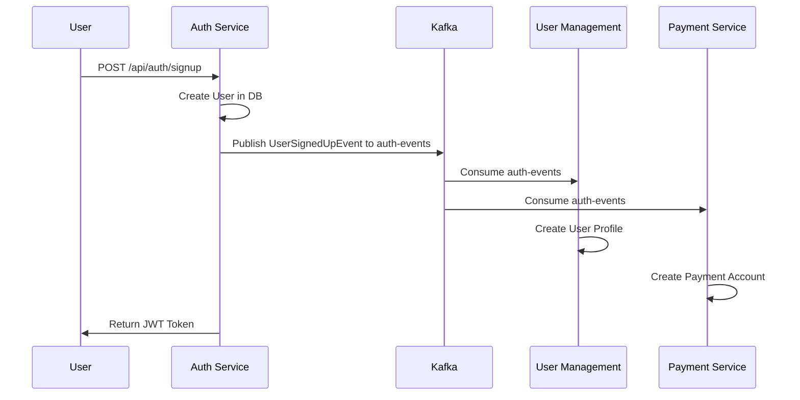
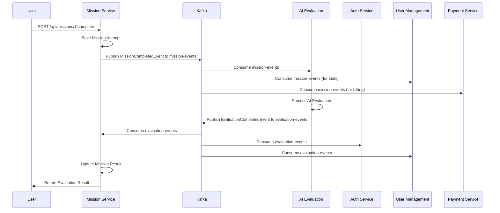
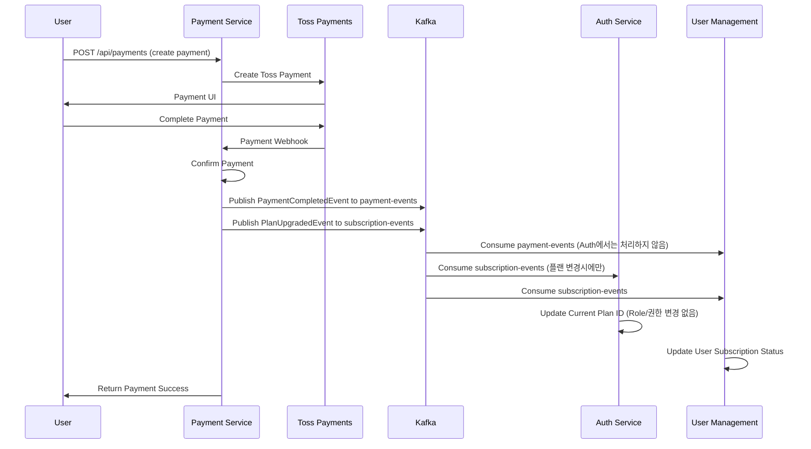

# DevTrip MSA Kafka 이벤트 플로우 문서 (실제 구현 기준)

## 1. Kafka 클러스터 구조

### 1.1 Kafka 설정
```yaml
# docker-compose.infrastructure.yml
services:
  devtrip-kafka:
    image: confluentinc/cp-kafka:7.4.0
    ports:
      - "9092:9092"
    environment:
      KAFKA_BROKER_ID: 1
      KAFKA_ZOOKEEPER_CONNECT: devtrip-zookeeper:2181
      KAFKA_ADVERTISED_LISTENERS: PLAINTEXT://devtrip-kafka:29092,PLAINTEXT_HOST://localhost:9092
```

### 1.2 관리 도구
- **Kafka UI**: http://localhost:8079
- **브로커 주소**: localhost:9092 (외부), devtrip-kafka:29092 (내부)

### 1.3 구현된 토픽 목록
- `auth-events` - 인증 관련 모든 이벤트
- `payment-events` - 결제 완료/실패 이벤트
- `subscription-events` - 구독 상태 변경 이벤트
- `user-events` - 사용자 정보 변경 이벤트
- `mission-events` - 미션 관련 이벤트
- `evaluation-events` - AI 평가 관련 이벤트

## 2. 서비스별 Kafka 연결 및 이벤트

### 2.1 Authentication Service (Port: 8080)
#### Producer (발행하는 이벤트)
| Topic | Event Type | API Endpoint | Payload | 수신 서비스 | 설명 |
|-------|------------|--------------|---------|------------|------|
| `auth-events` | UserSignedUpEvent | `POST /api/auth/signup` | userId, email, ipAddress, timestamp | User Management, Payment | 신규 사용자 가입 |
| `auth-events` | UserLoggedInEvent | `POST /api/auth/login` | userId, email, ipAddress, userAgent, timestamp | User Management, Payment | 사용자 로그인 |
| `auth-events` | UserLoggedOutEvent | `POST /api/auth/logout` | userId, timestamp | User Management | 사용자 로그아웃 |
| `auth-events` | PasswordResetRequestedEvent | `POST /api/auth/password-reset` | userId, email, ipAddress, timestamp | User Management | 비밀번호 재설정 요청 |
| `auth-events` | PasswordChangedEvent | `PUT /api/auth/password` | userId, timestamp | User Management | 비밀번호 변경 |
| `auth-events` | AccountLockedEvent | 자동 트리거 | userId, reason, timestamp | User Management | 계정 잠금 |
| `auth-events` | TeamCreatedEvent | `POST /api/teams` | teamId, creatorId, teamName, timestamp | User Management | 팀 생성 |
| `auth-events` | TeamMemberAddedEvent | `POST /api/teams/{id}/members` | teamId, userId, role, timestamp | User Management | 팀 멤버 추가 |

#### Consumer (수신하는 이벤트)
| Topic | Source Service | Handler | 설명 |
|-------|---------------|---------|------|
| `payment-events` | Payment | PaymentEventListener | 결제 완료/실패 처리 |
| `mission-events` | Mission | MissionEventListener | 미션 일시정지/재개/리소스 이벤트 처리 |
| `evaluation-events` | AI Evaluation | EvaluationEventListener | AI 평가 결과 처리 |

#### Configuration
```properties
spring.kafka.bootstrap-servers=localhost:9092
spring.kafka.consumer.group-id=auth-service-group
spring.kafka.producer.key-serializer=org.apache.kafka.common.serialization.StringSerializer
spring.kafka.producer.value-serializer=org.springframework.kafka.support.serializer.JsonSerializer
```

### 2.2 User Management Service (Port: 8082)
#### Producer (발행하는 이벤트)
| Topic | Event Type | API Endpoint | Payload | 수신 서비스 | 설명 |
|-------|------------|--------------|---------|------------|------|
| `user-events` | UserProfileUpdatedEvent | `PUT /api/users/profile` | userId, profileData, timestamp | Payment, Mission | 사용자 프로필 업데이트 |
| `user-events` | UserTeamJoinedEvent | `POST /api/users/teams/join` | userId, teamId, timestamp | Payment, Mission | 팀 가입 |

#### Consumer (수신하는 이벤트)
| Topic | Source Service | Handler | 설명 |
|-------|---------------|---------|------|
| `auth-events` | Authentication | KafkaConsumerService | 인증 관련 이벤트 처리 (사용자 생성, 로그인 통계 등) |
| `payment-events` | Payment | PaymentEventListener | 결제 완료 시 사용자 구독 상태 업데이트 |
| `subscription-events` | Payment | PaymentEventListener | 구독 상태 변경 처리 |
| `mission-events` | Mission | MissionEventListener | 미션 완료 시 사용자 통계 업데이트 |
| `evaluation-events` | AI Evaluation | EvaluationEventListener | AI 평가 결과를 사용자 성과에 반영 |

#### Configuration
```properties
spring.kafka.bootstrap-servers=localhost:9092
spring.kafka.consumer.group-id=user-mgmt-service-group
```

### 2.3 Payment Service (Port: 8081)
#### Producer (발행하는 이벤트)
| Topic | Event Type | API Endpoint | Payload | 수신 서비스 | 설명 |
|-------|------------|--------------|---------|------------|------|
| `payment-events` | PaymentCompletedEvent | `POST /api/payments/toss/confirm` | paymentId, userId, amount, planType, timestamp | User | 결제 완료 이벤트 (Auth에서는 처리하지 않음) |
| `payment-events` | PaymentFailedEvent | `POST /api/payments/toss/confirm` | paymentId, userId, failureReason, timestamp | Auth, User | 결제 실패 이벤트 |
| `subscription-events` | PlanUpgradedEvent | `POST /api/payments/upgrade` | userId, fromPlan, toPlan, timestamp | Auth, User | 플랜 업그레이드 |
| `subscription-events` | PlanDowngradedEvent | `POST /api/payments/downgrade` | userId, fromPlan, toPlan, timestamp | Auth, User | 플랜 다운그레이드 |

#### Consumer (수신하는 이벤트)
| Topic | Source Service | Handler | 설명 |
|-------|---------------|---------|------|
| `auth-events` | Authentication | 자동 처리 | 신규 가입 시 결제 계정 생성 |
| `user-events` | User Management | TicketEventListener | 사용자 정보 동기화 |
| `mission-events` | Mission | TicketEventListener | 미션 완료 시 티켓 차감 처리 |
| `evaluation-events` | AI Evaluation | EvaluationEventListener | AI 평가 비용 정산 |

#### Configuration
```properties
spring.kafka.bootstrap-servers=localhost:9092
spring.kafka.consumer.group-id=payment-service-group

# Topic Names
kafka.topic.payment-events=payment-events
kafka.topic.subscription-events=subscription-events
kafka.topic.user-events=user-events
kafka.topic.mission-events=mission-events
```

### 2.4 Mission Management Service (Port: 8083)
#### Producer (발행하는 이벤트)
| Topic | Event Type | API Endpoint | Payload | 수신 서비스 | 설명 |
|-------|------------|--------------|---------|------------|------|
| `mission-events` | MissionStartedEvent | `POST /api/missions/{id}/start` | missionId, userId, timestamp | Auth, User, Payment | 미션 시작 |
| `mission-events` | MissionPausedEvent | `POST /api/missions/{id}/pause` | missionId, userId, pauseReason, timestamp | Auth, User | 미션 일시정지 |
| `mission-events` | MissionResumedEvent | `POST /api/missions/{id}/resume` | missionId, userId, pauseDuration, timestamp | Auth, User | 미션 재개 |
| `mission-events` | MissionCompletedEvent | `POST /api/missions/{id}/complete` | missionAttemptId, userId, missionId, code, timestamp | AI Evaluation, User, Payment | 미션 완료 - AI 평가 트리거 |
| `mission-events` | ResourceProvisioningFailedEvent | 자동 트리거 | userId, missionId, failureReason, retryAttempt | Auth | K8s 리소스 프로비저닝 실패 |
| `mission-events` | ResourceCleanupCompletedEvent | 자동 트리거 | userId, missionId, cleanupTrigger, resourcesCleaned | Auth | 리소스 정리 완료 |

#### Consumer (수신하는 이벤트)
| Topic | Source Service | Handler | 설명 |
|-------|---------------|---------|------|
| `user-events` | User Management | UserEventListener | 사용자 정보 동기화 |
| `evaluation-events` | AI Evaluation | AIEvaluationEventListener | AI 평가 완료 시 미션 결과 업데이트 |

#### Configuration
```properties
spring.kafka.bootstrap-servers=localhost:9092
spring.kafka.consumer.group-id=mission-service-group

# Topic Configuration
devtrip.kafka.topics.mission-events=mission-events
devtrip.kafka.topics.user-events=user-events
devtrip.kafka.topics.resource-events=resource-events
```

### 2.5 AI Evaluation Service (Port: 8084)
#### Producer (발행하는 이벤트)
| Topic | Event Type | API Endpoint | Payload | 수신 서비스 | 설명 |
|-------|------------|--------------|---------|------------|------|
| `evaluation-events` | EvaluationStartedEvent | 자동 트리거 | evaluationId, missionAttemptId, userId, timestamp | Auth, Mission | AI 평가 시작 |
| `evaluation-events` | EvaluationCompletedEvent | 자동 트리거 | evaluationId, missionAttemptId, userId, score, feedback, timestamp | Mission, Auth, User, Payment | AI 평가 완료 |
| `evaluation-events` | EvaluationFailedEvent | 자동 트리거 | evaluationId, missionAttemptId, userId, failureReason | Auth, Mission | AI 평가 실패 |
| `evaluation-events` | EvaluationRetryRequestedEvent | 자동 트리거 | evaluationId, originalEvaluationId, retryAttempt | Auth | AI 평가 재시도 요청 |
| `evaluation-events` | EvaluationRetryCompletedEvent | 자동 트리거 | evaluationId, retryAttempt, finalScore, needsHumanReview | Auth, Mission | AI 평가 재시도 완료 |

#### Consumer (수신하는 이벤트)
| Topic | Source Service | Handler | 설명 |
|-------|---------------|---------|------|
| `mission-events` | Mission | MissionCompletedEventConsumer | 미션 완료 시 AI 평가 시작 |

#### Configuration
```properties
spring.kafka.bootstrap-servers=localhost:9092
spring.kafka.consumer.group-id=ai-evaluation-group

# Topic Configuration
kafka.topic.mission-completed=mission.completed
kafka.topic.evaluation-completed=evaluation.completed
```

### 2.6 Monitoring Service (Port: 8085) - 개발 예정
#### Consumer (수신하는 이벤트)
| Topic | Source Service | Handler | 설명 |
|-------|---------------|---------|------|
| `auth.*` | Authentication | 모든 인증 이벤트 모니터링 |
| `payment-events` | Payment | 결제 이벤트 모니터링 |
| `mission-events` | Mission Management | 미션 이벤트 모니터링 |
| `evaluation.completed` | AI Evaluation | 평가 완료 모니터링 |

## 3. 실제 이벤트 플로우 다이어그램

### 3.1 사용자 가입 플로우 (실제 구현)


### 3.2 미션 완료 및 AI 평가 플로우 (실제 구현)


### 3.3 결제 및 구독 플로우 (실제 구현)


## 4. 토픽 명명 규칙

### 4.1 서비스별 토픽 (Recommended)
```
{service-name}.{event-type}
예시: auth.user-signed-up, payment.subscription-created
```

### 4.2 도메인별 토픽 (Current)
```
{domain}-events
예시: user-events, payment-events, mission-events
```

### 4.3 특정 이벤트 토픽
```
{entity}.{action}
예시: mission.completed, evaluation.completed
```

## 5. 메시지 구조 및 스키마

### 5.1 공통 메시지 헤더
```json
{
  "eventId": "uuid",
  "eventType": "string",
  "source": "service-name",
  "timestamp": "ISO8601",
  "version": "1.0"
}
```

### 5.2 UserSignedUpEvent (실제 구현)
```json
{
  "authUserId": "auth_user_123",
  "userId": 123,
  "email": "user@devtrip.com",
  "ipAddress": "192.168.1.100",
  "timestamp": 1705312200000
}
```

### 5.3 MissionCompletedEvent (실제 구현)
```json
{
  "eventType": "mission.completed",
  "missionAttemptId": "attempt_789",
  "userId": 123,
  "authUserId": "auth_user_123",
  "email": "user@devtrip.com", 
  "missionId": "mission_1",
  "missionTitle": "첫 번째 JavaScript 미션",
  "code": "function hello() { return 'Hello, DevTrip!'; }",
  "language": "javascript",
  "completedAt": 1705312500000,
  "executionTime": 1500
}
```

### 5.4 EvaluationCompletedEvent (실제 구현)
```json
{
  "eventType": "evaluation.completed",
  "evaluationId": "eval_999",
  "missionAttemptId": "attempt_789",
  "userId": 123,
  "authUserId": "auth_user_123",
  "email": "user@devtrip.com",
  "missionId": "mission_1",
  "missionTitle": "첫 번째 JavaScript 미션",
  "score": 85,
  "maxScore": 100,
  "feedback": "우수한 구현입니다. 에러 핸들링을 추가하면 더 좋겠습니다.",
  "details": {
    "syntax": 95,
    "logic": 80,
    "performance": 85,
    "bestPractices": 80
  },
  "timestamp": 1705312800000
}
```

## 6. Error Handling 및 Retry 정책

### 6.1 Consumer Error Handling
```java
@KafkaListener(topics = "mission.completed", groupId = "ai-evaluation-group")
public void handleMissionCompletedEvent(
        @Payload MissionCompletedEvent event,
        Acknowledgment acknowledgment) {
    try {
        if (isValidEvent(event)) {
            evaluationService.processEvaluationAsync(event);
            acknowledgment.acknowledge();
        } else {
            log.warn("Invalid event received: {}", event);
            acknowledgment.acknowledge(); // Skip invalid events
        }
    } catch (Exception e) {
        log.error("Error processing event: {}", event, e);
        acknowledgment.acknowledge(); // Prevent infinite retry
    }
}
```

### 6.2 Producer Retry 설정
```properties
spring.kafka.producer.acks=1
spring.kafka.producer.retries=3
spring.kafka.producer.batch-size=16384
spring.kafka.producer.linger-ms=10
```

### 6.3 Consumer 설정
```properties
spring.kafka.consumer.auto-offset-reset=earliest
spring.kafka.consumer.enable-auto-commit=false
spring.kafka.consumer.max-poll-records=1
spring.kafka.consumer.session-timeout-ms=300000
```

## 7. 모니터링 및 운영

### 7.1 Kafka Metrics
```properties
management.endpoints.web.exposure.include=health,metrics,prometheus
management.metrics.export.prometheus.enabled=true
```

### 7.2 로그 모니터링
```properties
logging.level.org.apache.kafka=INFO
logging.level.org.springframework.kafka=DEBUG
```

### 7.3 Consumer Lag 모니터링
- Kafka UI에서 Consumer Group별 Lag 확인
- Prometheus + Grafana를 통한 메트릭 시각화

## 8. 개발 및 테스트 가이드

### 8.1 로컬 개발 환경 설정
```bash
# 전체 인프라 및 서비스 시작
docker-compose -f docker-compose.infrastructure.yml up -d
docker-compose up -d

# 개별 서비스 시작
docker-compose up auth-service
docker-compose up payment-service
docker-compose up mission-service
docker-compose up ai-evaluation-service
docker-compose up user-management-service
```

### 8.2 이벤트 테스트 (실제 API 호출)
```bash
# 1. 회원가입 이벤트 테스트
curl -X POST http://localhost:8080/api/auth/signup \
  -H "Content-Type: application/json" \
  -d '{"email": "test@devtrip.com", "password": "test123", "name": "테스트사용자"}'

# 2. 미션 완료 이벤트 테스트  
curl -X POST http://localhost:8083/api/missions/1/complete \
  -H "Content-Type: application/json" \
  -H "Authorization: Bearer YOUR_JWT_TOKEN" \
  -d '{"code": "console.log(\"Hello, DevTrip!\");", "language": "javascript"}'

# 3. 결제 완료 이벤트 테스트
curl -X POST http://localhost:8081/api/payments/toss/confirm \
  -H "Content-Type: application/json" \
  -d '{"paymentKey": "test_key", "orderId": "order_123", "amount": 29000}'
```

### 8.3 Integration Test
```java
@SpringBootTest
@TestPropertySource(properties = {
    "spring.kafka.bootstrap-servers=${spring.embedded.kafka.brokers}",
    "kafka.topic.mission-completed=mission.completed.test"
})
class KafkaIntegrationTest {
    
    @Test
    void shouldProcessMissionCompletedEvent() {
        // Given
        MissionCompletedEvent event = createTestEvent();
        
        // When
        kafkaTemplate.send("mission.completed.test", event).get();
        
        // Then
        await().atMost(Duration.ofSeconds(10))
               .until(() -> evaluationRepository.findByMissionAttemptId(event.getMissionAttemptId()).isPresent());
    }
}
```

## 9. 트러블슈팅

### 9.1 일반적인 문제
1. **Consumer Lag**: 파티션 수 증가 또는 Consumer 인스턴스 증가
2. **Message Loss**: acks 설정을 "all"로 변경
3. **Duplicate Processing**: Idempotent Consumer 구현

### 9.2 데드 레터 큐 (DLQ) 구현
```java
@Component
public class DeadLetterQueueHandler {
    
    @KafkaListener(topics = "mission.completed.dlq")
    public void handleDeadLetterQueue(ConsumerRecord<String, String> record) {
        log.error("Dead letter message: {}", record.value());
        // 수동 처리 또는 알림
    }
}
```

## 10. 구현 현황 및 향후 개선사항

### 10.1 현재 구현 상태 ✅
- **이벤트 기반 아키텍처**: 5개 서비스 간 완전한 이벤트 드리븐 통신
- **6개 주요 토픽**: auth-events, payment-events, subscription-events, user-events, mission-events, evaluation-events
- **16가지 이벤트 타입**: 회원가입부터 AI 평가까지 전체 비즈니스 플로우 커버
- **보안 중심 설계**: 모든 이벤트를 보안 관점에서 처리 (AuthSecurityService)
- **에러 처리**: 각 Consumer에서 예외 처리 및 로깅 구현
- **비동기 처리**: CompletableFuture 기반 논블로킹 이벤트 발행

### 10.2 향후 개선사항 🚀

#### 10.2.1 Schema Registry 도입
- Confluent Schema Registry를 통한 메시지 스키마 관리
- Avro/JSON Schema 기반 하위 호환성 보장
- 스키마 진화(Schema Evolution) 지원

#### 10.2.2 Event Sourcing 패턴
- 이벤트 저장소 구현 (EventStore)
- 애그리게이트 상태 재구성
- 완전한 감사 로그(Audit Log) 시스템

#### 10.2.3 SAGA 패턴 구현
- 분산 트랜잭션 관리 (Choreography-based)
- Compensation 로직 구현
- 데이터 일관성 보장 메커니즘

#### 10.2.4 Circuit Breaker & Resilience
- Kafka 장애 시 Fallback 메커니즘
- Hystrix/Resilience4j 기반 장애 격리
- Dead Letter Queue (DLQ) 고도화

#### 10.2.5 모니터링 & 옵저버빌리티
- Distributed Tracing (Jaeger/Zipkin)
- Kafka Metrics & Alerting
- Event-driven Business Intelligence

### 10.3 테스트 자동화 🧪
- Contract Testing (Pact)
- Event-driven Integration Tests
- Chaos Engineering for Kafka

**📝 상세한 테스트 가이드는 `KAFKA_EVENT_TESTING_GUIDE.md` 참조**