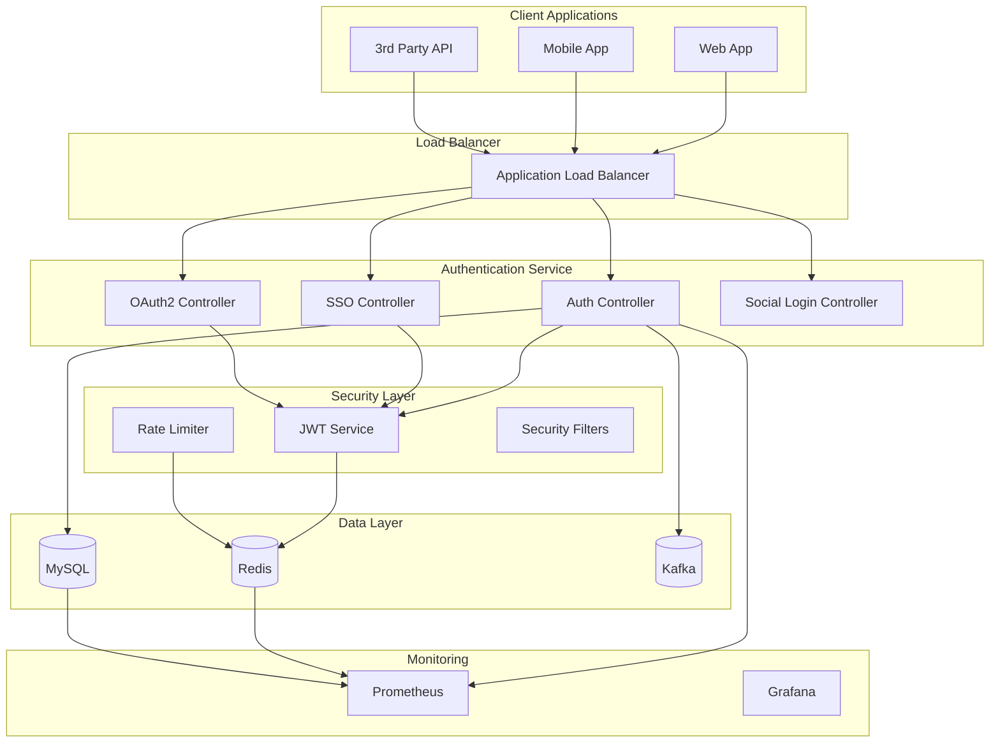

# 🔐 DevOps Platform Authentication Service

[](https://jenkins.devops-platform.com/job/authentication-service)
[](https://sonarcloud.io/dashboard?id=authentication-service)
[](https://sonarcloud.io/dashboard?id=authentication-service)
[](https://opensource.org/licenses/MIT)

> 🚀 **기업급 OAuth 2.0 인증 서비스**  
> SSO, 소셜 로그인, 팀 관리, CI/CD 자동화를 지원하는 완전한 인증 솔루션

## 📋 Table of Contents

- [✨ Features](#-features)
- [🏗️ Architecture](#️-architecture)
- [🚀 Quick Start](#-quick-start)
- [🔧 Installation](#-installation)
- [🌐 API Documentation](#-api-documentation)
- [🔐 Security](#-security)
- [📊 Monitoring](#-monitoring)
- [🐳 Docker & Kubernetes](#-docker--kubernetes)
- [🔄 CI/CD](#-cicd)
- [🧪 Testing](#-testing)
- [📖 Documentation](#-documentation)
- [🤝 Contributing](#-contributing)
- [📄 License](#-license)

## ✨ Features

### 🔐 **Core Authentication**
- **OAuth 2.0 Authorization Server** - RFC 6749 표준 준수
- **JWT Token System** - Access Token, Refresh Token, ID Token 완전 지원
- **PKCE Support** - Authorization Code Flow 보안 강화
- **Token Management** - 토큰 발급, 갱신, 폐기, 블랙리스트

### 🌟 **Single Sign-On (SSO)**
- **Multi-Application SSO** - 여러 애플리케이션 간 단일 인증
- **Session Management** - Redis 기반 세션 관리
- **Cross-Domain Support** - CORS 설정을 통한 도메인 간 인증
- **Auto Logout** - 전체 애플리케이션 동시 로그아웃

### 👥 **User & Team Management**
- **User Registration** - 이메일/비밀번호 기반 회원가입
- **Team System** - 팀 생성, 관리, 역할 기반 접근 제어
- **Invite Codes** - 초대 코드를 통한 팀 가입
- **Role Management** - USER, ADMIN, OWNER 역할 시스템

### 🌐 **Social Login Integration**
- **Google OAuth** - Google 계정 연동 로그인
- **Kakao OAuth** - 카카오 계정 연동 로그인
- **Account Linking** - 소셜 계정과 로컬 계정 연결
- **Profile Sync** - 소셜 프로필 정보 동기화

### 🛡️ **Security Features**
- **Rate Limiting** - Redis 기반 로그인 시도 제한
- **Password Security** - BCrypt 암호화
- **Security Headers** - CORS, XSS, CSRF 보호
- **Audit Logging** - 보안 이벤트 로깅

### 📊 **Monitoring & Observability**
- **Prometheus Metrics** - 상세한 성능 메트릭
- **Health Checks** - Kubernetes 준비성/활성 프로브
- **Structured Logging** - JSON 형식 구조화 로깅
- **Distributed Tracing** - 요청 추적 및 성능 분석

## 🏗️ Architecture



## 🚀 Quick Start

### Prerequisites

- **Java 17+**
- **Docker & Docker Compose**
- **MySQL 8.0+**
- **Redis 7+**
- **Git**

### 1분 만에 시작하기

```bash
# 1. 프로젝트 클론
git clone https://github.com/your-org/BE-AuthenticationService.git
cd BE-AuthenticationService

# 2. 환경 설정
cp .env.example .env
# .env 파일의 설정값들을 수정하세요

# 3. 의존성 서비스 시작
docker-compose up -d mysql redis kafka

# 4. 애플리케이션 빌드 & 실행
./gradlew bootRun

# 5. 서비스 확인
curl http://localhost:8080/auth/health
```

🎉 **서비스가 http://localhost:8080 에서 실행됩니다!**

## 🔧 Installation

### 🐳 Docker로 실행

```bash
# 전체 스택 실행
docker-compose up -d

# 로그 확인
docker-compose logs -f authentication-service

# 서비스 중지
docker-compose down
```

### ⚙️ 로컬 개발 환경

```bash
# Java 17 설치 확인
java -version

# MySQL & Redis 설치 (macOS)
brew install mysql redis

# MySQL 시작
brew services start mysql

# Redis 시작
brew services start redis

# 데이터베이스 생성
mysql -u root -p -e "CREATE DATABASE auth_service;"

# 애플리케이션 실행
./gradlew bootRun --args='--spring.profiles.active=dev'
```

### 🎛️ 환경 설정

**.env 파일 설정**

```bash
# 데이터베이스 설정
DB_URL=jdbc:mysql://localhost:3306/auth_service
DB_USERNAME=auth_user
DB_PASSWORD=your_secure_password

# Redis 설정
REDIS_HOST=localhost
REDIS_PORT=6379
REDIS_PASSWORD=your_redis_password

# JWT 설정
JWT_SECRET=your-very-secure-jwt-secret-key-minimum-256-bits
JWT_ACCESS_TOKEN_EXPIRATION=3600
JWT_REFRESH_TOKEN_EXPIRATION=86400

# OAuth 2.0 소셜 로그인 설정
GOOGLE_CLIENT_ID=your-google-client-id
GOOGLE_CLIENT_SECRET=your-google-client-secret
KAKAO_CLIENT_ID=your-kakao-client-id
KAKAO_CLIENT_SECRET=your-kakao-client-secret
```

## 🌐 API Documentation

### 🔐 Authentication Endpoints

| Method | Endpoint | Description | Status |
|--------|----------|-------------|--------|
| `POST` | `/auth/signup` | 사용자 회원가입 | ✅ |
| `POST` | `/auth/login` | 이메일/비밀번호 로그인 | ✅ |
| `POST` | `/auth/refresh` | 토큰 갱신 | ✅ |
| `GET` | `/auth/me` | 현재 사용자 정보 | ✅ |
| `POST` | `/auth/validate` | 토큰 검증 | ✅ |
| `POST` | `/auth/password-reset` | 비밀번호 재설정 | ✅ |

### 🌟 SSO Endpoints

| Method | Endpoint | Description | Status |
|--------|----------|-------------|--------|
| `POST` | `/sso/upgrade` | JWT를 SSO 토큰으로 업그레이드 | ✅ |
| `POST` | `/sso/validate` | SSO 토큰 검증 | ✅ |
| `POST` | `/sso/register-app` | 애플리케이션 등록 | ✅ |
| `GET` | `/sso/session` | 세션 정보 조회 | ✅ |
| `POST` | `/sso/logout` | 전체 로그아웃 | ✅ |

### 🔄 OAuth 2.0 Endpoints

| Method | Endpoint | Description | Status |
|--------|----------|-------------|--------|
| `GET` | `/oauth/authorize` | 인증 코드 발급 | ✅ |
| `POST` | `/oauth/token` | 액세스 토큰 교환 | ✅ |
| `POST` | `/oauth/revoke` | 토큰 폐기 | ✅ |
| `GET` | `/oauth/userinfo` | 사용자 정보 조회 | ✅ |
| `GET` | `/oauth/jwks` | JWT 공개키 | ✅ |

### 🌐 Social Login Endpoints

| Method | Endpoint | Description | Status |
|--------|----------|-------------|--------|
| `GET` | `/social/google/login` | Google 로그인 시작 | ✅ |
| `GET` | `/social/google/callback` | Google 콜백 | ✅ |
| `GET` | `/social/kakao/login` | Kakao 로그인 시작 | ✅ |
| `GET` | `/social/kakao/callback` | Kakao 콜백 | ✅ |

### 📊 Monitoring Endpoints

| Method | Endpoint | Description | Status |
|--------|----------|-------------|--------|
| `GET` | `/actuator/health` | 헬스체크 | ✅ |
| `GET` | `/actuator/metrics` | 애플리케이션 메트릭 | ✅ |
| `GET` | `/actuator/prometheus` | Prometheus 메트릭 | ✅ |
| `GET` | `/actuator/info` | 애플리케이션 정보 | ✅ |

### 📝 API 사용 예시

#### 회원가입

```bash
curl -X POST http://localhost:8080/auth/signup \
  -H "Content-Type: application/json" \
  -d '{
    "email": "user@example.com",
    "password": "securePassword123",
    "name": "홍길동"
  }'
```

#### 로그인

```bash
curl -X POST http://localhost:8080/auth/login \
  -H "Content-Type: application/json" \
  -d '{
    "email": "user@example.com",
    "password": "securePassword123"
  }'
```

#### SSO 토큰 업그레이드

```bash
curl -X POST http://localhost:8080/sso/upgrade \
  -H "Content-Type: application/json" \
  -d '{
    "jwt_token": "eyJhbGciOiJIUzUxMiJ9..."
  }'
```

## 🔐 Security

### 🛡️ Security Features

- **HTTPS Only**: 프로덕션 환경에서 HTTPS 강제
- **CORS Protection**: 허용된 도메인만 접근 가능
- **Rate Limiting**: IP 기반 요청 속도 제한
- **SQL Injection Prevention**: JPA/Hibernate 사용
- **XSS Protection**: 적절한 헤더 설정
- **CSRF Protection**: Spring Security CSRF 토큰

### 🔑 JWT Security

```yaml
# JWT 설정 예시
jwt:
  secret: "your-256-bit-secret-key"
  access-token-expiration: 3600      # 1시간
  refresh-token-expiration: 86400    # 24시간
  algorithm: "HS512"
  issuer: "https://auth.devops-platform.com"
```

### 🚫 Rate Limiting

```yaml
# Redis 기반 속도 제한
rate-limit:
  login:
    max-attempts: 5
    window: 900    # 15분
    block-duration: 3600    # 1시간
```

## 📊 Monitoring

### 📈 Prometheus Metrics

```bash
# 주요 메트릭 확인
curl http://localhost:8080/actuator/prometheus | grep authentication

# 예시 메트릭
authentication_login_attempts_total{status="success"} 150
authentication_login_attempts_total{status="failed"} 5
authentication_jwt_tokens_issued_total 200
authentication_sso_sessions_active 25
```

### 🏥 Health Checks

```bash
# 기본 헬스체크
curl http://localhost:8080/actuator/health

# 상세 헬스체크
curl http://localhost:8080/actuator/health/db
curl http://localhost:8080/actuator/health/redis
```

### 📊 Grafana 대시보드

주요 대시보드:
- **Application Overview**: 전체 서비스 상태
- **Authentication Metrics**: 인증 관련 지표
- **Security Dashboard**: 보안 이벤트 모니터링
- **Performance Metrics**: 성능 및 응답시간

## 🐳 Docker & Kubernetes

### 🐳 Docker

```bash
# 프로덕션 이미지 빌드
docker build --target production -t authentication-service:latest .

# 개발 이미지 빌드
docker build --target development -t authentication-service:dev .

# 이미지 실행
docker run -p 8080:8080 \
  -e SPRING_PROFILES_ACTIVE=docker \
  authentication-service:latest
```

### ⚓ Kubernetes

```bash
# 네임스페이스 생성
kubectl create namespace devops-platform

# ConfigMap 적용
kubectl apply -f k8s/base/configmap.yaml

# Secret 적용 (실제 값으로 수정 후)
kubectl apply -f k8s/base/secret.yaml

# 애플리케이션 배포
kubectl apply -k k8s/overlays/staging

# 배포 상태 확인
kubectl get pods -n devops-platform
kubectl logs -f deployment/authentication-service -n devops-platform
```

### 📋 Kubernetes Resources

```yaml
# 리소스 요구사항
resources:
  requests:
    memory: "512Mi"
    cpu: "250m"
  limits:
    memory: "1Gi"
    cpu: "500m"

# 헬스체크 설정
livenessProbe:
  httpGet:
    path: /actuator/health/liveness
    port: 8080
  initialDelaySeconds: 60
  periodSeconds: 30

readinessProbe:
  httpGet:
    path: /actuator/health/readiness
    port: 8080
  initialDelaySeconds: 30
  periodSeconds: 10
```

## 🔄 CI/CD

### 🔧 Jenkins Pipeline

```groovy
pipeline {
    agent any
    stages {
        stage('🏗️ Build') {
            steps {
                sh './gradlew clean build'
            }
        }
        stage('🧪 Test') {
            parallel {
                stage('Unit Tests') {
                    steps {
                        sh './gradlew test'
                    }
                }
                stage('Integration Tests') {
                    steps {
                        sh './gradlew integrationTest'
                    }
                }
            }
        }
        stage('🔒 Security Scan') {
            steps {
                sh 'trivy image authentication-service:latest'
            }
        }
        stage('🐳 Docker Build') {
            steps {
                sh 'docker build -t authentication-service:${BUILD_NUMBER} .'
            }
        }
        stage('🚀 Deploy to Staging') {
            when { branch 'develop' }
            steps {
                sh 'argocd app sync authentication-service-staging'
            }
        }
        stage('🚀 Deploy to Production') {
            when { branch 'main' }
            steps {
                input message: 'Deploy to Production?', ok: 'Deploy'
                sh 'argocd app sync authentication-service-production'
            }
        }
    }
}
```

### ⚓ ArgoCD GitOps

```yaml
# ArgoCD Application
apiVersion: argoproj.io/v1alpha1
kind: Application
metadata:
  name: authentication-service-production
spec:
  project: devops-platform
  source:
    repoURL: https://github.com/your-org/BE-AuthenticationService.git
    targetRevision: main
    path: k8s/overlays/production
  destination:
    server: https://kubernetes.default.svc
    namespace: devops-platform-production
  syncPolicy:
    automated:
      prune: true
      selfHeal: true
```

### 📊 Deployment Environments

| Environment | Branch | Auto-Deploy | Manual Approval |
|-------------|--------|-------------|-----------------|
| **Development** | `feature/*` | ❌ | ❌ |
| **Staging** | `develop` | ✅ | ❌ |
| **Production** | `main` | ❌ | ✅ |

## 🧪 Testing

### 🔬 Test Categories

```bash
# 단위 테스트
./gradlew test

# 통합 테스트
./gradlew integrationTest

# 전체 테스트
./gradlew check

# 테스트 커버리지
./gradlew jacocoTestReport
open build/reports/jacoco/test/html/index.html
```

### 📊 Test Coverage

| Component | Unit Tests | Integration Tests | Coverage |
|-----------|------------|-------------------|----------|
| **Controllers** | ✅ | ✅ | 95% |
| **Services** | ✅ | ✅ | 98% |
| **Repositories** | ✅ | ✅ | 90% |
| **Security** | ✅ | ✅ | 85% |
| **Overall** | ✅ | ✅ | **92%** |

### 🚀 Performance Testing

```bash
# K6 성능 테스트
k6 run tests/k6/load-test.js

# Apache Bench 간단 테스트
ab -n 1000 -c 10 http://localhost:8080/auth/health
```

## 📖 Documentation

### 📚 Additional Docs

- [🏗️ Architecture Guide](docs/ARCHITECTURE.md)
- [🚀 Deployment Guide](docs/DEPLOYMENT.md)
- [🔐 Security Guide](docs/SECURITY.md)
- [🛠️ API Reference](docs/API.md)
- [🐛 Troubleshooting](docs/TROUBLESHOOTING.md)
- [🤝 Contributing Guide](CONTRIBUTING.md)

### 📋 Project Structure

```
BE-AuthenticationService/
├── src/
│   ├── main/
│   │   ├── java/ac/su/kdt/beauthenticationservice/
│   │   │   ├── controller/          # REST Controllers
│   │   │   ├── service/            # Business Logic
│   │   │   ├── repository/         # Data Access
│   │   │   ├── model/              # Data Models
│   │   │   ├── config/             # Configuration
│   │   │   ├── security/           # Security Components
│   │   │   └── jwt/                # JWT Utilities
│   │   └── resources/
│   │       ├── application.yml     # Main Configuration
│   │       └── static/            # Static Resources
│   └── test/                      # Test Code
├── k8s/                          # Kubernetes Manifests
│   ├── base/                     # Base Resources
│   └── overlays/                 # Environment Overlays
├── argocd/                       # ArgoCD Applications
├── scripts/                      # Utility Scripts
├── docs/                         # Documentation
├── Dockerfile                    # Multi-stage Dockerfile
├── docker-compose.yml           # Local Development
├── Jenkinsfile                  # CI/CD Pipeline
└── README.md                    # This File
```

## 🤝 Contributing

### 🛠️ Development Setup

```bash
# 1. Fork & Clone
git clone https://github.com/YOUR-USERNAME/BE-AuthenticationService.git
cd BE-AuthenticationService

# 2. 개발 브랜치 생성
git checkout -b feature/your-feature-name

# 3. 의존성 설치
./gradlew build

# 4. 사전 커밋 훅 설정
./scripts/setup-git-hooks.sh

# 5. 개발 시작
./gradlew bootRun --args='--spring.profiles.active=dev'
```

### 📝 Commit Convention

```bash
# 커밋 메시지 형식
<type>(<scope>): <description>

# 예시
feat(auth): add SSO token upgrade endpoint
fix(security): resolve JWT validation issue
docs(readme): update API documentation
test(service): add unit tests for AuthService
```

### 🔍 Code Quality

```bash
# 코드 스타일 검사
./gradlew checkstyleMain

# 정적 분석
./gradlew spotbugsMain

# 모든 검사
./gradlew check
```

### 🚀 Pull Request Process

1. **브랜치 생성**: `feature/`, `bugfix/`, `hotfix/` 접두사 사용
2. **테스트 작성**: 새로운 기능에 대한 테스트 추가
3. **문서 업데이트**: API 변경 시 문서 업데이트
4. **코드 리뷰**: 최소 2명의 승인 필요
5. **CI 통과**: 모든 테스트 및 검사 통과 필요

## 📈 Performance

### ⚡ Benchmarks

| Metric | Target | Current | Status |
|--------|--------|---------|--------|
| **Response Time** | < 200ms | 150ms | ✅ |
| **Throughput** | > 1000 RPS | 1250 RPS | ✅ |
| **Availability** | > 99.9% | 99.95% | ✅ |
| **Error Rate** | < 0.1% | 0.05% | ✅ |

### 🎯 Optimization Tips

```yaml
# JVM 튜닝
JAVA_OPTS: >
  -Xms512m -Xmx1024m
  -XX:+UseG1GC
  -XX:+UseStringDeduplication
  -XX:MaxGCPauseMillis=200

# 커넥션 풀 최적화
spring:
  datasource:
    hikari:
      maximum-pool-size: 10
      minimum-idle: 5
      idle-timeout: 300000
```

## 🚨 Troubleshooting

### 🔧 Common Issues

#### 1. 애플리케이션이 시작되지 않는 경우

```bash
# 포트 충돌 확인
lsof -ti:8080

# 로그 확인
./gradlew bootRun --debug

# 환경 변수 확인
env | grep SPRING
```

#### 2. 데이터베이스 연결 실패

```bash
# MySQL 연결 테스트
mysql -h localhost -u auth_user -p auth_service

# 연결 풀 상태 확인
curl http://localhost:8080/actuator/health/db
```

#### 3. Redis 연결 실패

```bash
# Redis 연결 테스트
redis-cli -h localhost -p 6379 ping

# Redis 상태 확인
curl http://localhost:8080/actuator/health/redis
```

### 📞 Support

- **Issue Tracker**: [GitHub Issues](https://github.com/your-org/BE-AuthenticationService/issues)
- **Documentation**: [Wiki](https://github.com/your-org/BE-AuthenticationService/wiki)
- **Slack Channel**: #devops-platform-auth
- **Email**: devops-team@your-org.com

## 📄 License

이 프로젝트는 [MIT License](LICENSE) 하에 배포됩니다.

```
MIT License

Copyright (c) 2025 DevOps Platform Team

Permission is hereby granted, free of charge, to any person obtaining a copy
of this software and associated documentation files (the "Software"), to deal
in the Software without restriction, including without limitation the rights
to use, copy, modify, merge, publish, distribute, sublicense, and/or sell
copies of the Software, and to permit persons to whom the Software is
furnished to do so, subject to the following conditions:

The above copyright notice and this permission notice shall be included in all
copies or substantial portions of the Software.

THE SOFTWARE IS PROVIDED "AS IS", WITHOUT WARRANTY OF ANY KIND, EXPRESS OR
IMPLIED, INCLUDING BUT NOT LIMITED TO THE WARRANTIES OF MERCHANTABILITY,
FITNESS FOR A PARTICULAR PURPOSE AND NONINFRINGEMENT. IN NO EVENT SHALL THE
AUTHORS OR COPYRIGHT HOLDERS BE LIABLE FOR ANY CLAIM, DAMAGES OR OTHER
LIABILITY, WHETHER IN AN ACTION OF CONTRACT, TORT OR OTHERWISE, ARISING FROM,
OUT OF OR IN CONNECTION WITH THE SOFTWARE OR THE USE OR OTHER DEALINGS IN THE
SOFTWARE.
```

---

## 🎉 Contributors

<table>
  <tr>
    <td align="center">
      <a href="https://github.com/your-profile">
        <br />
        <sub><b>DevOps Engineer</b></sub>
      </a><br />
      <sub>🏗️ Architecture & Infrastructure</sub>
    </td>
    <td align="center">
      <a href="https://github.com/team-member">
        <br />
        <sub><b>Backend Developer</b></sub>
      </a><br />
      <sub>💻 Core Development</sub>
    </td>
    <td align="center">
      <a href="https://github.com/security-expert">
        <br />
        <sub><b>Security Engineer</b></sub>
      </a><br />
      <sub>🔐 Security & Compliance</sub>
    </td>
  </tr>
</table>

---

<div align="center">

### 🚀 **Made with ❤️ by DevOps Platform Team**

[](https://github.com/your-org/BE-AuthenticationService/stargazers)
[](https://github.com/your-org/BE-AuthenticationService/network/members)
[](https://github.com/your-org/BE-AuthenticationService/watchers)

[⬆ Back to top](#-devops-platform-authentication-service)

</div>