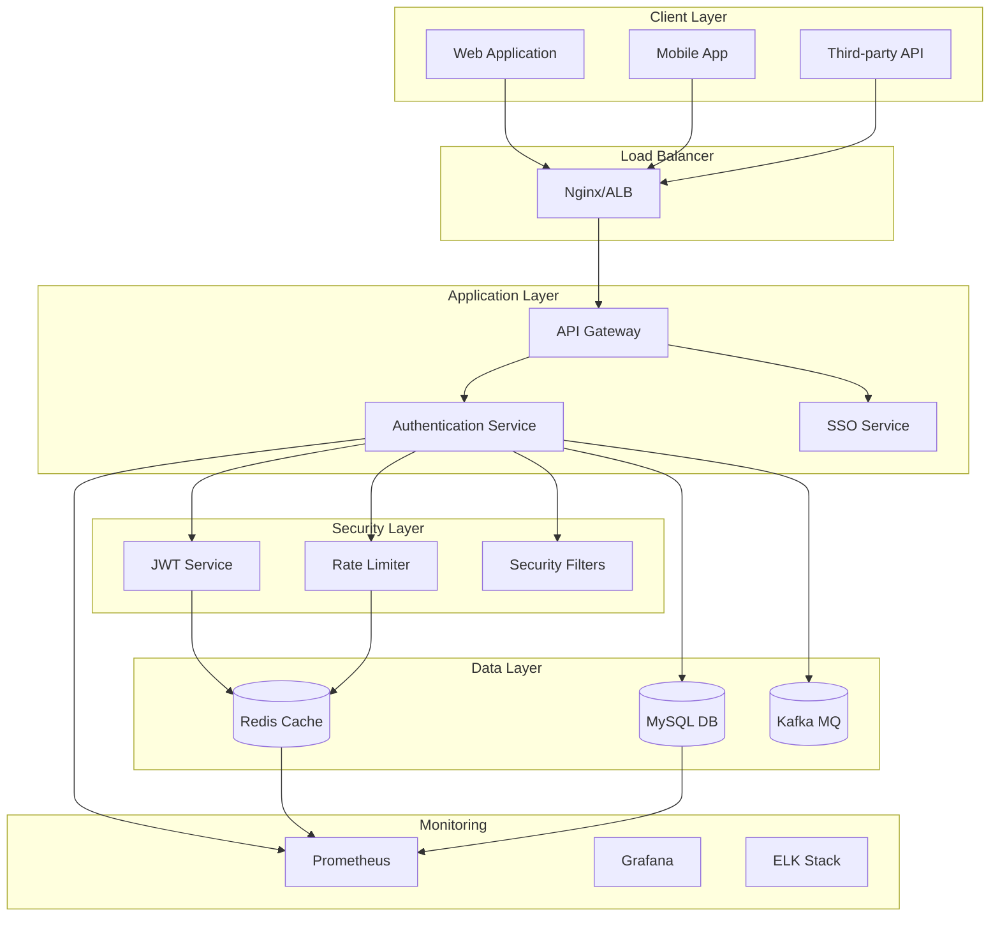
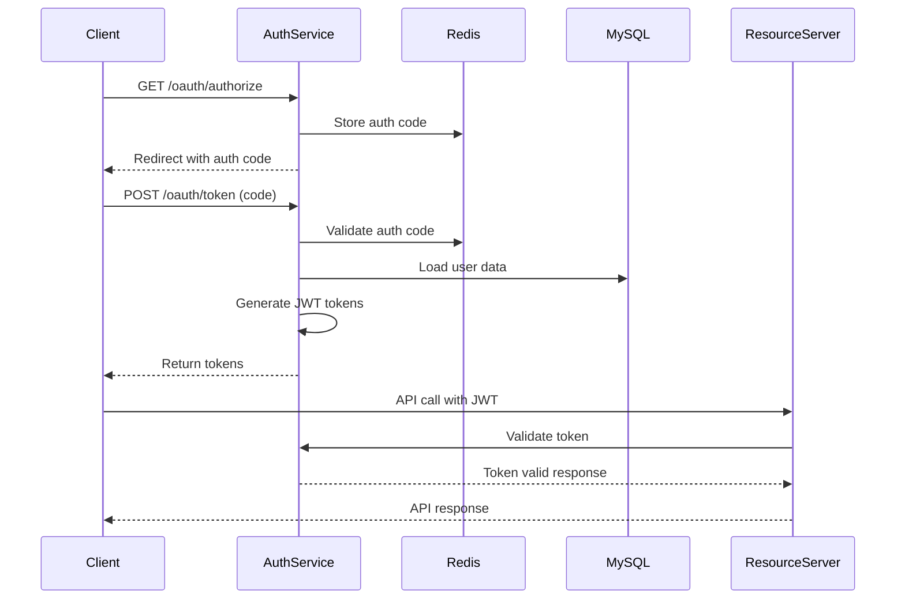
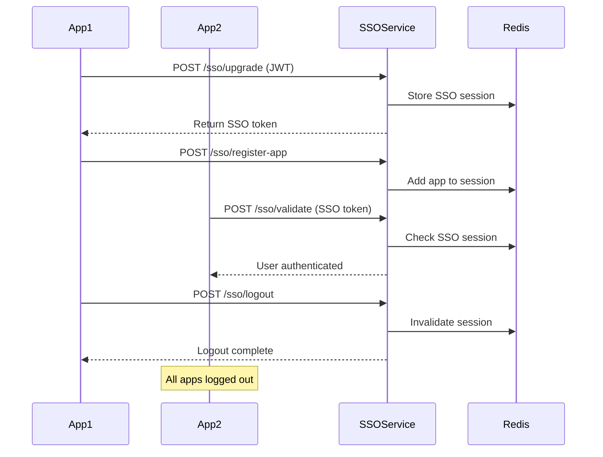
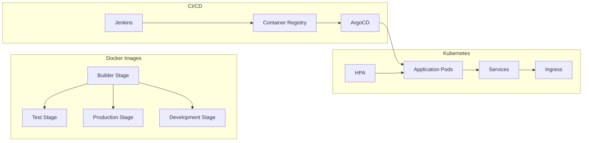
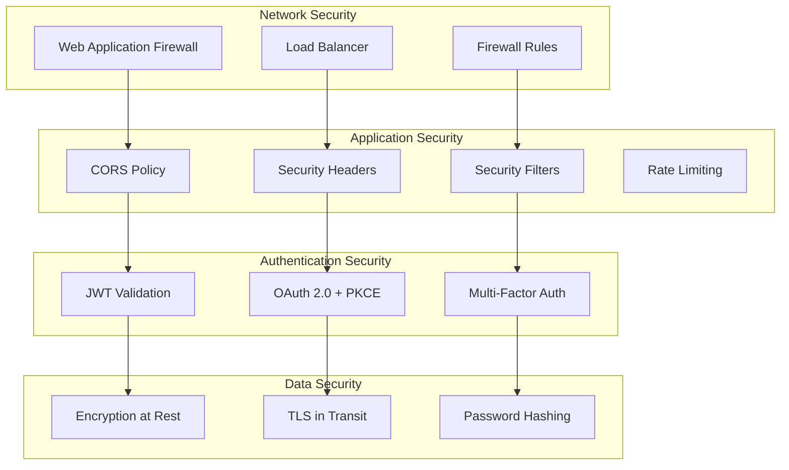
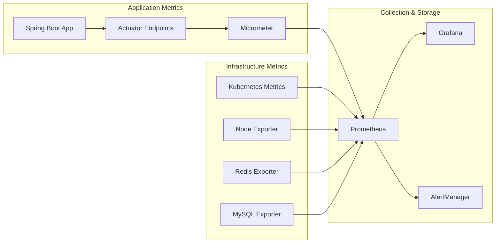
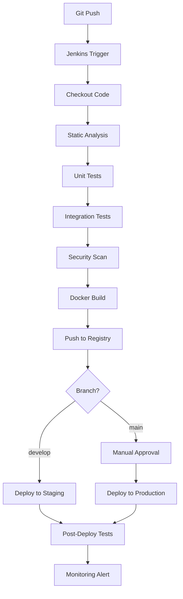
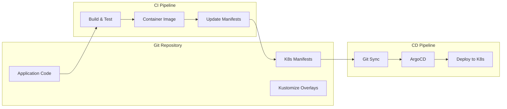

# 🏗️ Authentication Service Architecture

## 📖 Overview

DevOps Platform Authentication Service는 기업급 OAuth 2.0 기반의 인증 서비스로, SSO(Single Sign-On), 소셜 로그인, 팀 관리 기능을 제공하는 마이크로서비스입니다.

## 🎯 Core Features

### 🔐 Authentication & Authorization
- **OAuth 2.0 Authorization Server**: RFC 6749 표준 준수
- **JWT Token System**: Access Token, Refresh Token, ID Token 지원
- **SSO (Single Sign-On)**: 여러 애플리케이션 간 단일 인증
- **Social Login**: Google, Kakao 소셜 로그인 통합

### 👥 User & Team Management
- **User Registration**: 이메일/비밀번호 기반 회원가입
- **Team System**: 팀 생성, 초대 코드 기반 가입
- **Role-based Access Control**: USER, ADMIN, OWNER 역할 관리

### 🛡️ Security Features
- **Rate Limiting**: Redis 기반 로그인 시도 제한
- **Password Security**: BCrypt 암호화
- **Token Blacklisting**: 토큰 무효화 시스템
- **CORS & Security Headers**: 웹 보안 강화

## 🏗️ System Architecture



## 🔧 Technology Stack

### Backend Framework
- **Spring Boot 3.5.4**: 메인 애플리케이션 프레임워크
- **Spring Security 6**: 보안 및 인증
- **Spring Data JPA**: 데이터 접근 계층
- **Spring Data Redis**: 캐시 및 세션 관리
- **Spring Kafka**: 메시지 큐 시스템

### Database & Cache
- **MySQL 8.0**: 주요 데이터베이스
- **Redis 7**: 캐시, 세션, 속도 제한
- **Apache Kafka**: 이벤트 스트리밍

### Security & Tokens
- **JJWT 0.12.3**: JWT 토큰 처리
- **BCrypt**: 비밀번호 암호화
- **OAuth 2.0 + PKCE**: 보안 강화

### Monitoring & Observability
- **Micrometer + Prometheus**: 메트릭 수집
- **Spring Boot Actuator**: 헬스체크 및 관리
- **Logback**: 구조화된 로깅

## 📊 Database Schema

```sql
-- Users Table
CREATE TABLE users (
    id VARCHAR(36) PRIMARY KEY,
    email VARCHAR(255) UNIQUE NOT NULL,
    password_hash VARCHAR(255),
    name VARCHAR(100) NOT NULL,
    social_provider VARCHAR(50),
    social_user_id VARCHAR(255),
    role ENUM('USER', 'ADMIN', 'OWNER') DEFAULT 'USER',
    current_tickets INT DEFAULT 100,
    is_active BOOLEAN DEFAULT TRUE,
    email_verified BOOLEAN DEFAULT FALSE,
    picture_url TEXT,
    created_at TIMESTAMP DEFAULT CURRENT_TIMESTAMP,
    updated_at TIMESTAMP DEFAULT CURRENT_TIMESTAMP ON UPDATE CURRENT_TIMESTAMP,
    
    INDEX idx_email (email),
    INDEX idx_social_provider_id (social_provider, social_user_id),
    INDEX idx_role (role),
    INDEX idx_active (is_active)
);

-- Teams Table
CREATE TABLE teams (
    id BIGINT AUTO_INCREMENT PRIMARY KEY,
    name VARCHAR(100) NOT NULL,
    description TEXT,
    invite_code VARCHAR(20) UNIQUE,
    invite_code_expires_at TIMESTAMP,
    max_members INT DEFAULT 50,
    is_public BOOLEAN DEFAULT FALSE,
    created_at TIMESTAMP DEFAULT CURRENT_TIMESTAMP,
    updated_at TIMESTAMP DEFAULT CURRENT_TIMESTAMP ON UPDATE CURRENT_TIMESTAMP,
    
    INDEX idx_invite_code (invite_code),
    INDEX idx_public (is_public)
);

-- Team Members Table
CREATE TABLE team_members (
    id BIGINT AUTO_INCREMENT PRIMARY KEY,
    team_id BIGINT NOT NULL,
    user_id VARCHAR(36) NOT NULL,
    role ENUM('OWNER', 'ADMIN', 'MEMBER') DEFAULT 'MEMBER',
    joined_via_invite_code VARCHAR(20),
    is_active BOOLEAN DEFAULT TRUE,
    joined_at TIMESTAMP DEFAULT CURRENT_TIMESTAMP,
    
    FOREIGN KEY (team_id) REFERENCES teams(id) ON DELETE CASCADE,
    FOREIGN KEY (user_id) REFERENCES users(id) ON DELETE CASCADE,
    UNIQUE KEY unique_team_user (team_id, user_id),
    INDEX idx_team_role (team_id, role),
    INDEX idx_user_active (user_id, is_active)
);
```

## 🔄 API Flow Diagrams

### OAuth 2.0 Authorization Code Flow



### SSO Authentication Flow



## 🚀 Deployment Architecture

### Container Strategy



### Environment Strategy

| Environment | Purpose | Auto-Deploy | Approval Required |
|-------------|---------|-------------|-------------------|
| **Development** | 개발자 로컬 테스트 | ❌ | ❌ |
| **Staging** | 통합 테스트 및 QA | ✅ | ❌ |
| **Production** | 운영 환경 | ❌ | ✅ |

## 📈 Scalability & Performance

### Horizontal Scaling
- **Stateless Design**: 모든 상태는 Redis/Database에 저장
- **Load Balancing**: Kubernetes Service를 통한 자동 로드 밸런싱
- **Auto Scaling**: HPA를 통한 CPU/Memory 기반 자동 확장

### Caching Strategy
- **Redis Cache**: 세션, JWT 블랙리스트, 속도 제한
- **Application Cache**: Spring Cache 추상화 활용
- **Database Connection Pool**: HikariCP 최적화

### Performance Optimizations
- **G1 Garbage Collector**: 낮은 지연시간
- **Connection Pooling**: Database, Redis 연결 풀
- **Async Processing**: Kafka를 통한 비동기 이벤트 처리

## 🛡️ Security Architecture

### Defense in Depth



### Security Controls
- **Input Validation**: 모든 입력 데이터 검증
- **SQL Injection Prevention**: JPA/Hibernate 사용
- **XSS Protection**: 적절한 인코딩 및 헤더
- **CSRF Protection**: Spring Security CSRF 토큰

## 📊 Monitoring & Observability

### Metrics Collection



### Key Performance Indicators

| Metric Category | Key Metrics | Thresholds |
|-----------------|-------------|------------|
| **Availability** | Uptime, Health Check Success Rate | > 99.9% |
| **Performance** | Response Time, Throughput | < 200ms, > 1000 RPS |
| **Security** | Failed Login Attempts, Token Validation Rate | < 5%, > 99% |
| **Resources** | CPU, Memory, Disk Usage | < 80% |

## 🔄 CI/CD Pipeline

### Jenkins Pipeline Stages



### GitOps with ArgoCD



## 🎯 Future Roadmap

### Short Term (Q1 2025)
- [ ] Multi-tenancy support
- [ ] Advanced audit logging
- [ ] GraphQL API support
- [ ] Mobile SDK development

### Medium Term (Q2-Q3 2025)
- [ ] Machine learning-based fraud detection
- [ ] Passwordless authentication (WebAuthn)
- [ ] Advanced analytics dashboard
- [ ] Multi-region deployment

### Long Term (Q4 2025+)
- [ ] Blockchain-based identity verification
- [ ] AI-powered security insights
- [ ] Edge computing support
- [ ] Quantum-safe cryptography

## 📚 Additional Resources

- [API Documentation](./API.md)
- [Deployment Guide](./DEPLOYMENT.md)
- [Security Guide](./SECURITY.md)
- [Troubleshooting Guide](./TROUBLESHOOTING.md)
- [Contributing Guide](../CONTRIBUTING.md)